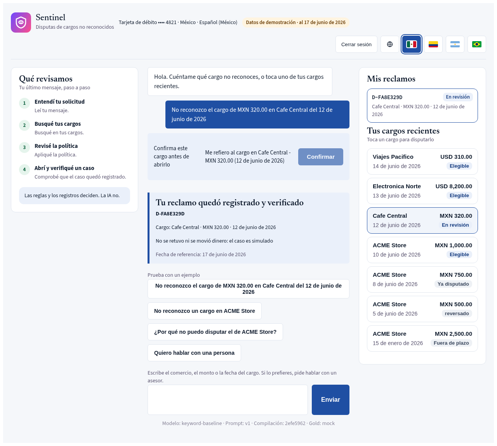

# Sentinel Engine

| 🎯 Pitch | 💬 Live demo | 📊 Presentation | 🎬 Video |
|---|---|---|---|
| [Project site](https://rdorta27.github.io/factored-hackathon-2026-sentinel-engine/?lang=en) | [Demo on Azure](https://sentinel-engine.ambitiousmoss-1416426d.eastus.azurecontainerapps.io) | [Slides](https://rdorta27.github.io/factored-hackathon-2026-sentinel-engine/slides/deck.html) | <!-- video-url -->[Watch on YouTube](https://youtu.be/0bjonPPvhEA)<!-- /video-url --> |

The demo credentials come in the submission email.

**The AI talks. The rules decide.**

A bank customer says "I do not recognize this charge". Sentinel finds the charge, checks the policy, opens a verified dispute in one conversation, or gives an advisor a complete case file. It speaks Spanish and Portuguese. It acts only when the policy allows it. It never invents a fact.

Factored AI & Data Hackathon 2026 · Transaction disputes for a bank in México, Colombia and Argentina · Prototype

Read more: [Product](docs/product.md) · [What is real](docs/architecture/what-is-real.md) · [Evidence index](evidence/README.md) · [Metrics report](docs/build/metrics-report.md)



## Contents

1. [What Sentinel does](#what-sentinel-does)
2. [How it works](#how-it-works)
3. [Headline results](#headline-results)
4. [Where to find everything](#where-to-find-everything)
5. [Run it locally](#run-it-locally)
6. [Demo and production](#demo-and-production)
7. [Limitations](#limitations)
8. [Roadmap](#roadmap)
9. [Team and rules](#team-and-rules)

## What Sentinel does

Sentinel is an assistant, not only a chatbot. It handles the **intake and triage** of a transaction dispute. It does not decide the outcome of the dispute, and it does not move money.

| Step | What the code does |
|---|---|
| Understand | Labels the intent. Masks personal data before the model call |
| Find | Looks up the charges of the logged-in customer in Gold and narrows them with the words of the customer |
| Decide | The policy engine checks the status of the charge, the dispute window, a prior dispute, the fraud rule and the amount rule |
| Confirm | Shows the charge in a confirm box. The assistant never opens a dispute without the confirmation of the customer |
| Act and verify | Opens the case once (idempotent) and reads it back before it says that the case exists |
| Hand off | Files a ticket for an advisor with the request, the verified facts, the actions, the evidence and the open questions |

The system files a handoff ticket on its own when a rule asks for it:

- The customer insists on a person.
- The customer says that the charge is not theirs.
- A fraud rule or a high-amount rule fires.
- Required fields are missing.
- The third question has no answer.

The advisor reads the ticket in a read-only view of the same page, with the trace of each step. The decision on the dispute belongs to the bank.

## How it works

The guiding principle: **AI understands; code executes and verifies.** The loop is the one that the hackathon asks for: Understand → Decide → Act → Verify → Escalate. Policy, confirmations and the session are in code. The model never sees the customer identifiers.


| Layer | What it is |
|---|---|
| **Data** | A Delta Lakehouse: S3 raw data → Bronze → Silver → Gold. DuckDB runs it locally. The Azure Databricks mode is implemented and not deployed. Both use the same `sentinel_data` package. |
| **Service** | One FastAPI process with the page, the orchestrator, the policy engine and four session-bound tools. One API under `/api/v1`: `auth`, `transactions`, `chat`, `disputes` (two steps), `handoffs` (advisor) and `health`. |
| **Router** | `router_v2`, a prompted GLM 5.3 Flash that only labels the intent. The keyword baseline answers a turn when the model fails. Both are behind one model port. |
| **State** | Sessions, conversation state, disputes and handoff tickets are in SQLite. A restart keeps them. |
| **Human in the loop** | Each handoff becomes a ticket with the reason, a summary, the verified facts and every action that the system tried. |

Safety in code, before and around the model call:

- Code masks personal identifiers in the customer text.
- Code refuses a request to reveal the prompt and records injection attempts.
- Fraud and high-amount handoffs use synthetic thresholds per account country and currency. A bank replaces them in configuration.
- A "why?" gets its answer from the stored policy decision, not from the model.

The [architecture](docs/architecture/README.md) pages give the target system, the demo with its mocks, and the specification.

**Live link.** The demo runs on Azure Container Apps with one replica until the awards ([019](docs/build/decisions/019-azure-container-apps.md)). It uses labelled mock data and `router_v2` (prompt `v2`), and it keeps its state on an Azure Files share. The live revision is from 2026-10-05. Its `/health` `bundle_hash` is `2efe5962f9a50d0b4fed8e7b91c10a4c7fd212d5229d74a2e58d1024ee96dfd2`, the hash of the sealed v8 measurement.

## Headline results

All numbers are **simulation** on team-written cases, not production measurements ([what is real](docs/architecture/what-is-real.md#numbers)). Each row cites a field of a frozen `summary.json`.

| Result | Baseline | `router_v2` | Field |
|---|---|---|---|
| Intent accuracy, sealed held-out set (n = 308) | 0.6916 | 0.8182 | [eval-v8](evidence/evaluation-runs/2024Q4-eval-v8/summary.json): `candidates.<version>.intent.accuracy` |
| Model latency p50 / p95 (ms) | code only | 1474.2 / 4317.14 | `candidates.router_v2.latency_ms` |
| Safe automated resolution, mock store (n = 56) | 16 | 16 | [resolution-v2](evidence/evaluation-runs/2024Q4-resolution-v2/summary.json): `system.<version>.safe_resolution.resolved` |
| Unsafe outcomes, resolution set | 0/56 | 0/56 | `system.<version>.unsafe_outcomes.rate` |
| Cost per successful resolution (USD) | 0 | 0.000561 | `system.<version>.cost_usd.per_resolution` |
| Unsafe outcomes, adversarial suite | 0/42 | | [adversarial](evidence/adversarial/20261005T014816Z/summary.json): `totals.unsafe_outcome_rate` |

A **safe automated resolution** means that an eligible case ends in a verified case with no person. A correct handoff or refusal does not count as resolved. It counts under escalation quality.

The single v8 measurement ran six candidates on two sealed sets. The verdict serves `router_v2`. `router_v3` has the higher kind accuracy (0.974), but it fails the zero-unsafe-wording gate (4/93) and the subtype gate (0.8971 against 0.95). Decision [018](docs/build/decisions/018-evaluation-acceptance.md#result-v8-added-2026-10-05) gives the gates and the failed rules.

The [metrics report](docs/build/metrics-report.md) gives the intervals, the breakdown by language and country, and the limits.

## Where to find everything

### Start with a question

| You want to know | Go to |
|---|---|
| What the challenge asks and how the judges score it | [The challenge](docs/overview.md) |
| What the product does for a bank | [Product](docs/product.md) · [Project site](https://rdorta27.github.io/factored-hackathon-2026-sentinel-engine/?lang=en) |
| Which parts are real and which are mocks | [What is real](docs/architecture/what-is-real.md) · [Mocks](docs/architecture/mocks.md) |
| Why we chose transaction disputes | [Flow selection](docs/build/flows/03-flow-selection.md) |
| Why each main choice, with its evidence | [Rationale](docs/rationale/README.md) · [Decisions](docs/build/decisions/) |
| How we measured the model and the system | [Metrics report](docs/build/metrics-report.md) · [Model card](docs/build/model-card.md) · [Evidence index](evidence/README.md) |
| Which requirements are done | [Requirements](docs/requirements/requirements.md#status-by-priority) |
| How the assistant talks | [Conversation rules](docs/build/conversation.md) · [Glossary](docs/glossary/) |
| How safe it is | [Security](docs/build/security.md) · [Attack coverage](docs/rationale/attack-coverage.md) |
| What it costs | [Cost](docs/build/cost.md) · [ROI](docs/build/roi.md) (projection) · [Sizing](docs/sizing-capacity.md) |
| What the data holds | [Dataset](docs/data/dataset.md) · [Data dictionary](docs/data/reference/) · [Inventory](docs/data_inventory.md) |

The [documentation index](docs/README.md) gives the full reading order.

### Repository map

| Path | What it holds |
|---|---|
| **Product code** | |
| [`sentinel-ai-core/`](sentinel-ai-core/README.md) | The service: FastAPI, the orchestrator, the policy engine, the tools, the chat page and the advisor view (`app/`). The evaluation harness with the development cases, the sealed held-out set and the resolution set (`eval/`). The tests, with the adversarial suite (`tests/`). |
| [`sentinel-data-engine/`](sentinel-data-engine/README.md) | The medallion pipeline (S3 → Bronze → Silver → Gold) on Delta Lake. 13 LATAM Bank tables, about 19 M records. |
| [`deploy/azure/`](deploy/azure/README.md) | The Azure Container Apps deployment script, the judge users and the log queries |
| **Proof** | |
| [`evidence/`](evidence/README.md) | Frozen, reproducible runs. Each run has its scripts and a `summary.json`. The index gives the status and the data type of each run. |
| [`docs/build/metrics-report.md`](docs/build/metrics-report.md) | The full measurement, with intervals and limits |
| **Documentation** | |
| [`docs/architecture/`](docs/architecture/README.md) | System architecture, demo architecture, specification, mocks and what is real |
| [`docs/rationale/`](docs/rationale/README.md) | Why each choice, with an evidence table and the slide sentence |
| [`docs/build/`](docs/build/) | Conversation rules, decisions, metrics, security, cost and delivery |
| [`docs/requirements/`](docs/requirements/requirements.md) | Every requirement, with its status, sources and evidence |
| [`docs/data/`](docs/data/), [`docs/glossary/`](docs/glossary/) | The dataset, the official data dictionary and the locale vocabulary |
| **Pitch** | |
| [`site/`](site/) | The project site on GitHub Pages, in English, Spanish and Portuguese. The slides (`site/slides/`) and the diagrams (`site/diagrams/`). |
| [`branding/`](branding/BRANDING.md) | The brand tokens, the fonts and the chat styles |
| [`video/`](video/script.md) | The video script: the voice-over, the shot list and the mock page for each shot |
| **Tooling** | |
| [`scripts/`](scripts/) | Repository scripts: site numbers, diagrams, link checks, slide export and load runs |
| [`openspec/`](openspec/) | OpenSpec specs and the archive of each change |
| [`.github/workflows/`](.github/workflows/tests.yml) | CI: both test suites, the Markdown links and the requirement status that the specs cite |
| [`team/`](team/) | Plan, tasks and pending decisions |

## Run it locally

You need Python 3.12 or newer.

**1. Start the demo** with the labelled mock store:

```bash
cd sentinel-ai-core
python3 -m venv .venv && source .venv/bin/activate
pip install -e ".[dev]"
SENTINEL_GOLD_SOURCE=mock SENTINEL_REFERENCE_DATE=2026-06-17 uvicorn app.main:app
```

Open `http://localhost:8000/ui`. Log in as `CUST-0001`, `CUST-0002` or `CUST-0003`, with the password `Testpass-001`. These credentials are false and only for local runs and tests. The public link uses the credentials of the submission email.

**2. See the advisor side.** Start the service with the demo roles:

```bash
SENTINEL_GOLD_SOURCE=mock SENTINEL_DEMO_AUTH=1 uvicorn app.main:app
```

Ask for a person two times as a customer. Then log in as `ADV-0001` with the password `Advisor-001`.

**3. Use the measured router.** Without a model, the service uses the keyword baseline.

1. Copy `.env.example` to `.env`.
2. Fill in the `SENTINEL_LLM_*` values ([`.env.example`](.env.example), [secrets guide](sentinel-ai-core/README.md)).
3. Load the file: `set -a; source ../.env; set +a`.
4. Start `uvicorn` again. `GET /api/v1/health` shows the active model.

**4. Run the tests.** They need no model keys and no cloud credentials, and they write no evidence:

```bash
cd sentinel-ai-core && SENTINEL_WRITE_EVIDENCE=0 python3 -m pytest -q
cd ../sentinel-data-engine && pip install -e ".[dev]" && python3 -m pytest -q
```

Useful details:

| Topic | Detail |
|---|---|
| State | `sentinel-ai-core/var/sentinel.db` (gitignored). Delete it for a clean demo. |
| Turn log | `tail -f sentinel-ai-core/var/turns.jsonl` shows the structured log of each turn. |
| Gold source | `SENTINEL_GOLD_SOURCE` is `mock`, `duckdb` or `auto` (the default). `auto` uses the real Gold file when it is present. The test users exist only in `mock`. `GET /api/v1/health` shows the source in `gold_source`. |
| Data pipeline | Sync the raw tables into `data/raw/`, then build `data/gold_bank.duckdb`. See the [pipeline quickstart](sentinel-data-engine/README.md). Both folders are gitignored. |
| Replay a run | The [evidence index](evidence/README.md#evaluation-runs) tells how to replay each frozen run offline, and which runs match their frozen summary. |
| Deploy | [`deploy/azure/README.md`](deploy/azure/README.md) |

## Demo and production

The same code runs in the demo and in production. Each mock keeps the production contract, so production replaces a backend, not code.

| Part | Demo (this repository and the public link) | Production |
|---|---|---|
| Gold data | A labelled mock store, or the PII-free DuckDB view of the pipeline when you run it locally with the data file | Gold on Azure Databricks |
| Identity | Test users with a password. The public link has no passwordless entry. The credentials come in the submission email | The identity provider of the bank |
| Advisor | A demo advisor user with a read-only view | A human advisor. Tickets go to the CRM of the bank through a queue |
| Case store | SQLite | PostgreSQL |
| Dispute policy | Team-written files marked `synthetic: true` | The policy that the bank approves |
| Opening a dispute | The case store records the case. No bank system receives it | The dispute system of the bank |

The [mocks](docs/architecture/mocks.md) page gives the reason, the limit and the production backend of each mock.

## Limitations

What the prototype does not do (REQ-0013, REQ-0030). Each row links to the detail.

| Area | Limitation |
|---|---|
| **Mocks** | A test session, SQLite, a demo advisor user, a synthetic policy, a stand-in model in the test suite, and a labelled Gold mock on the public link ([mocks](docs/architecture/mocks.md)). |
| **Charge not yet in Gold** | The assistant treats it as not found. It names what it searched and, after repeated questions, files a handoff. It does **not** open a case marked as pending verification, the target behavior in the [conversation rules](docs/build/conversation.md#when-data-is-not-up-to-date). |
| **Data** | Synthetic and in Spanish only. The data cannot support a charge investigation. A `fraud_score` above 30 is always fraud, an artefact of the generator ([investigation data support](docs/rationale/investigation-data-support.md)). Real Gold runs locally only. |
| **Policy** | One 90-day window for the three countries, marked `synthetic: true`. The sources disagree per country. The engine cannot express a different window start, provisional credit or a response time ([021](docs/build/decisions/021-dispute-policy-sources.md)). |
| **Languages** | A model wrote the Portuguese (`pt-BR`) cases. No native speaker reviewed them. A Colombian teammate accepted the es-CO lines. A model checked the Mexican and Argentine lines ([018](docs/build/decisions/018-evaluation-acceptance.md)). The dataset transcripts are two Spanish templates ([evidence](evidence/transcript-chats/20261002T144836Z/summary.json)). |
| **Site translations** | A model wrote the Spanish and Portuguese copies of the site and the slides. English is the reference. |
| **Model** | A turn that falls back to the baseline has the accuracy of the baseline. The confidence cut-offs are descriptive (validation n = 26) and off by default ([calibration-v1](evidence/evaluation-runs/2024Q4-calibration-v1/summary.json), [cutoff diagnosis](evidence/evaluation-runs/2024Q4-cutoff-diagnosis-v1/summary.json)). The learned charge selector stays off, because it fails the serving rule ([025](docs/build/decisions/025-charge-selector.md)). |
| **State** | SQLite and one replica. Login and write-rate counters are per process. PostgreSQL is the path to more than one instance. |
| **Privacy** | Code masks free text by pattern. It does not detect personal data outside those patterns. |
| **Safety evidence** | `0/42` unsafe outcomes ([adversarial run](evidence/adversarial/20261005T014816Z/summary.json)). The three injection attempts also pass against the real router model ([real-model run](evidence/adversarial/20261005T204313Z/summary.json)). Known limitation B4: the service accepts a replayed bearer cookie. Zero unsafe outcomes on a small set does not prove zero risk. |
| **Resolution** | A simulation over the mock store only, with no pending charge. It is not a field resolution rate ([022](docs/build/decisions/022-resolution-acceptance.md)). |
| **Capacity** | About 5 requests a second on one replica at 0.5 vCPU and 1 GiB, with recorded answers ([load run](evidence/robustness/20261005T211031Z/summary.json), [capacity and latency](docs/rationale/capacity-and-latency.md)). |
| **Monitoring and ROI** | Country monitoring uses a replayed, simulated workload ([evidence](evidence/monitoring/2024Q4-resolution-v2-replay/summary.json)). The ROI is a break-even projection, not a measured saving ([roi](docs/build/roi.md)). |

## Roadmap

What the team did not build, and why. Each row cites its evidence (REQ-0030, REQ-0056). None of these is in the submission.

| Item | What it would do | Why we did not build it | Evidence |
|---|---|---|---|
| Customer 360 | Show balances and account history next to a charge | The balance has no usable as-of date. A complaint cannot be tied to a charge. | [`customer-360/dev-v1`](evidence/customer-360/dev-v1/summary.json): `balance.safe_to_show`, `balance.asof_usable`, `complaints.charge_linkable` |
| Investigation of a charge | Say that a charge is unusual for this customer | No customer signal predicts fraud in the synthetic data. It needs real bank data. | [`customer-360/dev-signals-v1`](evidence/customer-360/dev-signals-v1/summary.json): `investigation.has_signal`; [investigation data support](docs/rationale/investigation-data-support.md) |
| Feedback dataset | Keep the outcome that an advisor gives to each handoff, to train a model later | The dataset cannot train a dispute model. The system has no live traffic yet. | [`flows/2024Q4-v3`](evidence/flows/2024Q4-v3/summary.json): `disputes.cnr_learnable`, `disputes.esc_learnable` |
| Spending assistant | Answer questions about the spending of the customer | It needs balances and history. The data does not support them. | [`customer-360/dev-v1`](evidence/customer-360/dev-v1/summary.json): `balance.safe_to_show` |
| Policy retrieval | Read the dispute policy from the documents of the bank | The policy stays in code. The sources disagree and we have no bank document. | [policy sources](docs/rationale/policy-sources.md); the plan for the measure is in [metrics](docs/build/metrics.md) |
| Handoff routing | Send a handoff to an advisor with the right language and specialty | Not started. The demo has one advisor view. | [REQ-0046](docs/requirements/frontend-backend.md#req-0046) |

## Team and rules

- **No secrets and no data in the repository.** The repository is public. Credentials go in `.env` (gitignored). Teammates share them by direct message.
- **English, in ASD-STE100.** Code and documents are in English, in simplified technical English. The assistant answers in Spanish and Portuguese.
- **Label what is real.** Each number is real, mock, synthetic, team-generated, simulation or projection. A simulation is never shown as a production measurement.

| For | Read |
|---|---|
| A person who contributes | [`CONTRIBUTING.md`](CONTRIBUTING.md) |
| An AI agent | [`AGENTS.md`](AGENTS.md) |
| The plan, the tasks and the open decisions | [`team/plan.md`](team/plan.md), [`team/tasks.md`](team/tasks.md), [`team/pending-decisions.md`](team/pending-decisions.md) |
| The change history | [`CHANGELOG.md`](CHANGELOG.md) |
