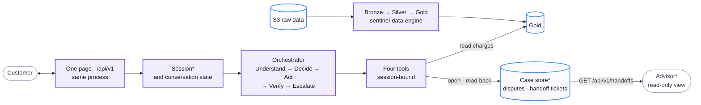

# Architecture

| Page | What it answers |
|---|---|
| [System Architecture](system-architecture.md) | The target: layers, components, a case end to end, the learned component, stack, repository layout |
| [Demo Architecture](demo-architecture.md) | The same page for the hackathon submission, with the mocks marked |
| [What is real](what-is-real.md) | Which parts are real, mocks, synthetic or team-generated, and which numbers are simulations or projections |
| [Architecture Specification](specification.md) | Contracts and rules: tools, confirmation, policy, personal data, failure handling, observability, evaluation, operations |

> **AI understands; code executes and verifies.**

Slide 2 is the picture below. Slide 5 is the [mocked components](demo-architecture.md#mocked-components).

The picture is the target system. **\*** In the demo, these parts are mocks with the same contract: a trusted test session, a SQLite case store instead of PostgreSQL, and a demo advisor user. The full list is in [mocked components](demo-architecture.md#mocked-components) and [what is real](what-is-real.md).

Legend: violet = component, blue = data store, grey = outside the system. The colours follow [`branding/`](../../branding/BRANDING.md). The picture shows the design, not the progress. The [component status](../../team/component-status.md) shows the progress.

**Status on 10/4:**

- Every component in the picture runs in `sentinel-ai-core/`.
- The pipeline in `sentinel-data-engine/` feeds the service locally through the PII-free DuckDB view.
- The public link runs on Azure Container Apps with the labelled Gold mock ([019](../build/decisions/019-azure-container-apps.md)).

Key properties:

- **One process.** FastAPI serves the page and the API. There is no second app. The advisor reads tickets in a read-only view of the same page ([009](../build/decisions/009-demo-ui-and-advisor-view.md)).
- **Session-bound tools.** The LLM never sees or chooses `customer_id`.
- **Verified actions only.** The customer gets a case number only after code reads the dispute back. A timeout is not a success.
- **Mocks keep the contract.** Each mock has the same contract as the real component. The move to production replaces a backend, not code.
