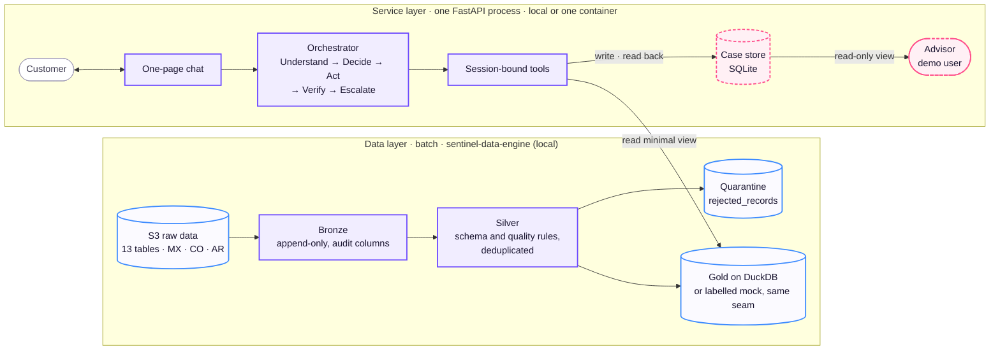

# Demo Architecture

This page shows what the hackathon submission runs. It has the same sections and diagrams as the [System Architecture](system-architecture.md). The difference: some components are **mocks**. Each mock keeps the contract of the real component, so the move to production replaces a backend, not code. The [Architecture Specification](specification.md) gives the behavior and the contracts. The [what is real](what-is-real.md) page labels each part.

Legend for every diagram: violet = component (same code as the target), blue = data store, **dashed rose = mock**, grey = outside the system.

## Central principle

**AI understands; code executes and verifies.** This is the same as the target. The demo does not simplify the loop, the policy in code, the session-bound tools or the read-back.

## Layers

- **Data layer.** The same pipeline, run locally on DuckDB. It ran end to end on the full dataset into `data/gold_bank.duckdb`, with a [quality report](../../sentinel-data-engine/data_quality_report.md).
  - The service reads the PII-free view `v_service_dispute_eligible_transactions` through a DuckDB adapter when the view is readable. Otherwise it reads the labelled mock (`SENTINEL_GOLD_SOURCE`). `GET /api/v1/health` tells which one is active.
  - The adapter opens the DuckDB file of the pipeline read-only (`SENTINEL_GOLD_DUCKDB`, or the data path of the repository). It excludes rows after the reference date.
  - Real customers log in through a local users file, written outside git (`scripts/write_real_gold_users.py`).
  - The public link has no data file. It serves the mock.
- **Service layer.** The same single process, locally or in one container behind the public link.
- **Case store.** A SQLite file with disputes and handoff tickets. One open dispute per charge. The idempotency key uses an opaque customer hash. Sessions and conversation state are in the same file, so a restart keeps them. One instance only. A conversation files one handoff ticket at most. Only the owner can read the file. In the container, the file is on an Azure Files share, so a restart keeps it ([019](../build/decisions/019-azure-container-apps.md)).

## Components

Each port keeps the target contract. Configuration selects the adapter:

- **Model:** `router_v2` when the `SENTINEL_LLM_*` variables are set. The keyword baseline is the fallback for each turn, and the default without a model.
- **Gold:** the DuckDB view or the labelled mock (`SENTINEL_GOLD_SOURCE`, reported by `/api/v1/health`).
- **State:** the SQLite file, or memory for tests and the offline eval (`SENTINEL_STATE_BACKEND`).

## Mocked components

| Component | Target | Demo mock | Limitation stated in the demo |
|---|---|---|---|
| Session | Identity provider | Test session: password login against a fixture of false credentials, role stored, cookie | No real identity; the advisor user exists only with `SENTINEL_DEMO_AUTH=1` |
| Policy configuration | The bank's approved policy | Synthetic file per country, written by the team | Not bank policy; fraud and high-amount thresholds are synthetic p95 values per account country and currency from evidence 2024Q4-v2 ([010](../build/decisions/010-fraud-handoff-rule.md), [011](../build/decisions/011-high-amount-threshold.md)); Mexican MXN has none; staleness ([014](../build/decisions/014-data-staleness.md)) stays off |
| Case store | PostgreSQL | SQLite file, same models (disputes, tickets, sessions, conversation) | One instance only; login-attempt counters per process |
| Advisor | Human advisor; tickets reach the bank's CRM through a queue ([015](../build/decisions/015-handoff-delivery.md)) | Demo advisor user reads the filed tickets in a read-only view | No claim, routing or state change |
| Secrets | Azure Key Vault | `.env`, gitignored | — |
| Gold (fallback) | Gold on Databricks | Labelled in-memory mock behind the same seam | Used when no DuckDB file is configured or readable, and always on the public link; reported by `/api/v1/health` |

All other parts of the diagrams run the target code.

## Walkthrough of a case

The same as the [System Architecture](system-architecture.md#walkthrough-of-a-case). In the demo, the *Case store* is a SQLite file, and the *Advisor* is a demo user with a read-only view. The steps, the confirmation and the read-back do not change.

## Learned component

The same as the target: a prompted LLM intent router, compared with the keyword baseline on the same sealed held-out conversations. The demo serves `router_v2` (GLM 5.3 Flash, prompt v2) from the environment, with the keyword baseline as the fallback. This is the configuration that `2024Q4-eval-v7` measured ([016](../build/decisions/016-router-models.md), [018](../build/decisions/018-evaluation-acceptance.md)). Models wrote the evaluation conversations in `es-419` and `pt-BR`. They have the label "simulation".

## Stack and deployment

| Piece | Demo |
|---|---|
| Platform | Local Linux; public link on Azure Container Apps ([012](../build/decisions/012-public-deployment.md), [019](../build/decisions/019-azure-container-apps.md)); the model spend is capped at the provider |
| Backend | Python and FastAPI, one process |
| Frontend | One page served by the same process (customer chat and read-only advisor view), styled with the `branding/` files. The bank name and accent come from `SENTINEL_BRAND_NAME` and `SENTINEL_BRAND_ACCENT`. The product in the header (type and last four digits) is team-generated demo data in the Gold mock; the real Gold shows no product. The steps panel replays the finished record of the turn |
| Data pipeline | The same `sentinel_data` package on DuckDB |
| Gold serving | DuckDB view, or the labelled mock |
| Case store | SQLite |
| LLM | `router_v2` (GLM 5.3 Flash on Fireworks AI) served, with the keyword baseline as the fallback behind the same port ([016](../build/decisions/016-router-models.md)) |
| Identity and secrets | Test session with password; `.env` |
| Serving | One process, no autoscaling |
| Observability | Structured turn records in a local file. On the public link, one JSON line per turn on standard output, sent to Log Analytics. |

## Repository layout

The same repository and folders as the target. The team plan gives the owners and the progress per folder.

## Out of scope for the submission

- PostgreSQL and more than one instance. The SQLite file serves one instance.
- Static masking in Silver and a token vault ([decision 004](../build/decisions/004-pii-lifecycle.md)). Code masks free customer text at the API boundary before the model. The masking is not reversible, because no demo tool needs the original value.
- A separate web app, an admin panel, advisor actions (claim, change of state), a proof-of-work card, a charge pause or an SLA timer. The advisor has a read-only ticket view ([009](../build/decisions/009-demo-ui-and-advisor-view.md)).
- Balances, products, cards and credit: out of the scope of the flow ([decision 008](../build/decisions/008-account-inquiry-scope.md)). The data also cannot support them ([investigation data support](../rationale/investigation-data-support.md)).
- Brazil as a market: `pt-BR` is a test language. Accounts exist only in México, Colombia and Argentina ([dataset assumptions](../understand/dataset.md#assumptions)).

## References

- Specification, including the real-or-mock table per component: [Architecture Specification](specification.md#path-to-production)
- When each mock may become real: [mocks](../../team/plan.md#mocks)
- Owners and progress: [folders](../../team/plan.md#folders)
- Demo deployment cost: [cost](../build/cost.md)
