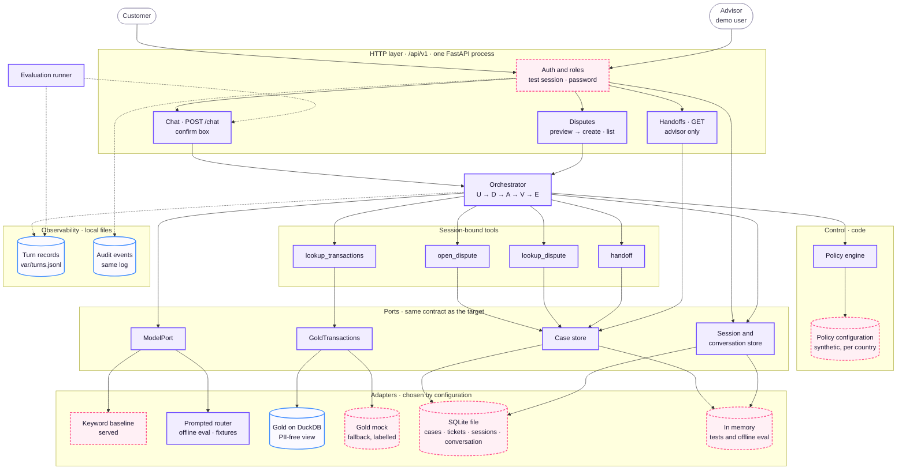

# Demo Architecture

What the hackathon submission runs. Same sections and diagrams as the [System Architecture](system-architecture.md); the difference is which components are **mocks**. Each mock keeps the contract of the real component, so moving to production swaps a backend, not code. Behaviour and contracts are in the [Architecture Specification](specification.md).

Legend for every diagram: violet = component (same code as the target), blue = data store, **dashed rose = mock**, grey = outside the system.

## Central principle

**AI understands; code executes and verifies.** Identical to the target: the loop, the policy in code, the session-bound tools and the read-back are not simplified for the demo.

## Layers

- **Data layer.** The same pipeline, run locally on DuckDB. The service reads the PII-free view `v_service_dispute_eligible_transactions` through a DuckDB adapter when the view is readable, and the labelled mock otherwise (`SENTINEL_GOLD_SOURCE`); `GET /api/v1/health` reports which one is active.
- **Service layer.** The same single process, run locally or in one container behind the public link.
- **Case store.** SQLite file with disputes (one open dispute per charge, idempotency scoped to an opaque customer hash) and handoff tickets. Sessions and conversation state live in the same file, so a restart keeps them; one instance only.

## Components

Each port keeps the target contract; the demo picks the adapter by configuration: the keyword baseline is served and the prompted router is measured offline (`create_app(model=...)`), Gold comes from the DuckDB view or the labelled mock (`SENTINEL_GOLD_SOURCE`, reported by `/api/v1/health`), and state lives in the SQLite file or in memory for tests and the offline eval (`SENTINEL_STATE_BACKEND`).

## Mocked components

| Component | Target | Demo mock | Limitation stated in the demo |
|---|---|---|---|
| Session | Identity provider | Test session: password login against a fixture of false credentials, role stored, cookie | No real identity; the advisor user exists only with `SENTINEL_DEMO_AUTH=1` |
| Policy configuration | The bank's approved policy | Synthetic file per country, written by the team | Not bank policy; fraud and high-amount thresholds are synthetic p95 values per account country and currency from evidence 2024Q4-v2 ([010](../build/decisions/010-fraud-handoff-rule.md), [011](../build/decisions/011-high-amount-threshold.md)); Mexican MXN has none; staleness (decision 27) stays off |
| Case store | PostgreSQL | SQLite file, same models (disputes, tickets, sessions, conversation) | One instance only; login-attempt counters per process |
| Advisor | Human advisor; delivery channel not decided (decision 28) | Demo advisor user reads the filed tickets in a read-only view | No claim, routing or state change |
| Secrets | Azure Key Vault | `.env`, gitignored | — |
| Gold (fallback) | Gold on Databricks | Labelled in-memory mock behind the same seam | Used when the DuckDB view is not readable; reported by `/api/v1/health` |

Everything else in the diagrams runs the target code.

## Walkthrough of a case

Identical to the [System Architecture](system-architecture.md#walkthrough-of-a-case). In the demo, the *Case store* is a SQLite file and the *Advisor* is a demo user with a read-only view; the steps, the confirmation and the read-back do not change.

## Learned component

Identical to the target: a prompted LLM that classifies the dispute category, compared with a keyword baseline and the same LLM zero-shot on the same held-out conversations. The served demo runs the keyword baseline behind the model port; the prompted router is measured offline by the evaluation runner, replaying recorded fixtures that mirror the baseline until a live model is configured (decision 10), so the measured delta is zero by construction. Serving the router needs only `create_app(model=...)`, no code change in the loop. Evaluation conversations are team-written in `es-419` and `pt-BR` and labelled as simulation.

## Stack and deployment

| Piece | Demo |
|---|---|
| Platform | Local Linux; optional public link on Azure Container Apps with a spend cap (decisions 13, 16) |
| Backend | Python and FastAPI, one process |
| Frontend | One page served by the same process (customer chat and read-only advisor view), styled with the `branding/` files |
| Data pipeline | The same `sentinel_data` package on DuckDB |
| Gold serving | DuckDB view, or the labelled mock |
| Case store | SQLite |
| LLM | Keyword baseline served; prompted router behind the same port, measured offline; model per route not decided (decision 10) |
| Identity and secrets | Test session with password; `.env` |
| Serving | One process, no autoscaling |
| Observability | Structured logs in local files |

## Repository layout

The same repository and folders as the target. Owners and progress per folder are in the team plan.

## Out of scope for the submission

- PostgreSQL and more than one instance (the SQLite file serves one).
- Masking of free customer text before the LLM and static masking in Silver (proposed, [decision 004](../build/decisions/004-pii-lifecycle.md)). If a customer types their national id, it reaches the LLM; the demo states this.
- A separate web app, an admin panel, advisor actions (claim, state change), a proof-of-work card, a charge pause or an SLA timer. The advisor has a read-only ticket view ([009](../build/decisions/009-demo-ui-and-advisor-view.md)).
- Balances, products, cards and credit: out of the flow's scope ([decision 008](../build/decisions/008-account-inquiry-scope.md)).
- Brazil as a market: `pt-BR` is a test language; the dataset covers Mexico, Colombia and Argentina.

## References

- Specification, including the real-or-mock table per component: [Architecture Specification](specification.md#path-to-production)
- When each mock may become real: [mocks](../../team/plan.md#mocks)
- Owners and progress: [folders](../../team/plan.md#folders)
- Demo deployment cost: [cost](../build/cost.md)
