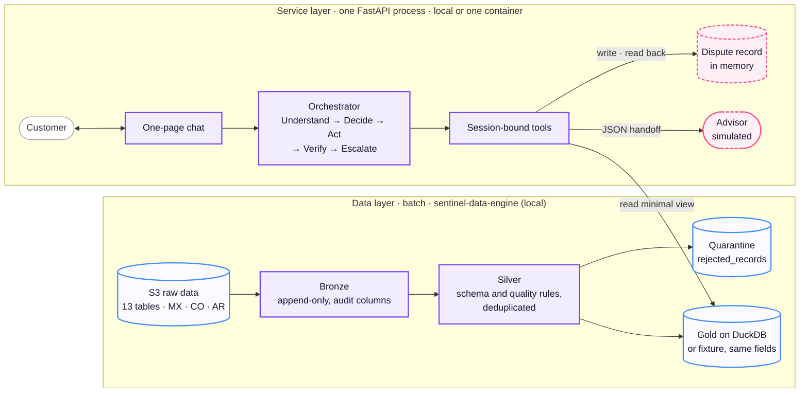
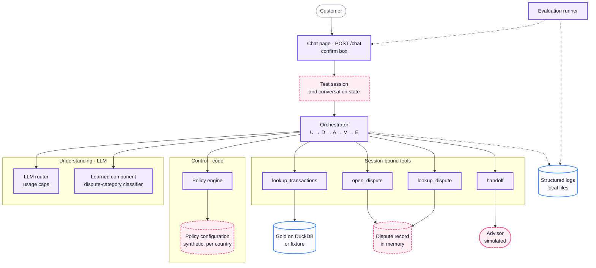

# Demo Architecture

What the hackathon submission runs. Same sections and diagrams as the [System Architecture](system-architecture.md); the difference is which components are **mocks**. Each mock keeps the contract of the real component, so moving to production swaps a backend, not code. Behaviour and contracts are in the [Architecture Specification](specification.md).

Legend for every diagram: violet = component (same code as the target), blue = data store, **dashed rose = mock**, grey = outside the system.

## Central principle

**AI understands; code executes and verifies.** Identical to the target: the loop, the policy in code, the session-bound tools and the read-back are not simplified for the demo.

## Layers

- **Data layer.** The same pipeline, run locally on DuckDB. If Gold is not connected to the service in time, `lookup_transactions` reads a fixture with the same fields, and the demo says which source it used.
- **Service layer.** The same single process, run locally or in one container behind the public link.
- **Dispute record.** In process memory, keyed by idempotency key. Lost on restart; the demo script does not restart.

## Components

## Mocked components

| Component | Target | Demo mock | Limitation stated in the demo |
|---|---|---|---|
| Session | Identity provider | Trusted test session | No real authentication |
| Policy configuration | The bank's approved policy | Synthetic file per country, written by the team | Not bank policy; open thresholds (decisions 25–27) use placeholder values |
| Dispute record | Relational store (engine not decided) | Dictionary in process memory | Lost on restart |
| Advisor | Human advisor; delivery channel not decided (decision 28) | Customer is told a person takes over; the package is returned and logged | Nothing is queued |
| Secrets | Azure Key Vault | `.env`, gitignored | — |
| Gold (fallback only) | Gold on Databricks | Fixture with the same fields | Used only if Gold is not connected; declared |

Everything else in the diagrams runs the target code.

## Walkthrough of a case

Identical to the [System Architecture](system-architecture.md#walkthrough-of-a-case). In the demo, *Dispute record* is the in-memory dictionary and *Advisor* is simulated; the steps, the confirmation and the read-back do not change.

## Learned component

Identical to the target: a prompted LLM that classifies the dispute category, compared with a keyword baseline and the same LLM zero-shot on the same held-out conversations. Until that comparison exists, the keyword rule fills the category and then remains as the baseline. Evaluation conversations are team-written in `es-419` and `pt-BR` and labelled as simulation.

## Stack and deployment

| Piece | Demo |
|---|---|
| Platform | Local Linux; optional public link on Azure Container Apps with a spend cap (decisions 13, 16) |
| Backend | Python and FastAPI, one process |
| Frontend | One-page chat served by the same process, styled with the `branding/` files |
| Data pipeline | The same `sentinel_data` package on DuckDB |
| Gold serving | DuckDB, or the fixture |
| Dispute record | In memory |
| LLM | Hybrid router with usage caps; model per route not decided |
| Identity and secrets | Test session; `.env` |
| Serving | One process, no autoscaling |
| Observability | Structured logs in local files |

## Repository layout

The same repository and folders as the target. Owners and progress per folder are in the team plan.

## Out of scope for the submission

- A decided dispute-record engine or schema.
- Masking of free customer text before the LLM and static masking in Silver (proposed, [decision 004](../build/decisions/004-pii-lifecycle.md)). If a customer types their national id, it reaches the LLM; the demo states this.
- A separate web app, an advisor screen, a proof-of-work card, a charge pause or an SLA timer.
- Balances, products, cards and credit: out of the flow's scope ([decision 008](../build/decisions/008-account-inquiry-scope.md)).
- Brazil as a market: `pt-BR` is a test language; the dataset covers Mexico, Colombia and Argentina.

## References

- Specification, including the real-or-mock table per component: [Architecture Specification](specification.md#path-to-production)
- When each mock may become real: [mocks](../../team/plan.md#mocks)
- Owners and progress: [folders](../../team/plan.md#folders)
- Demo deployment cost: [cost](../build/cost.md)
