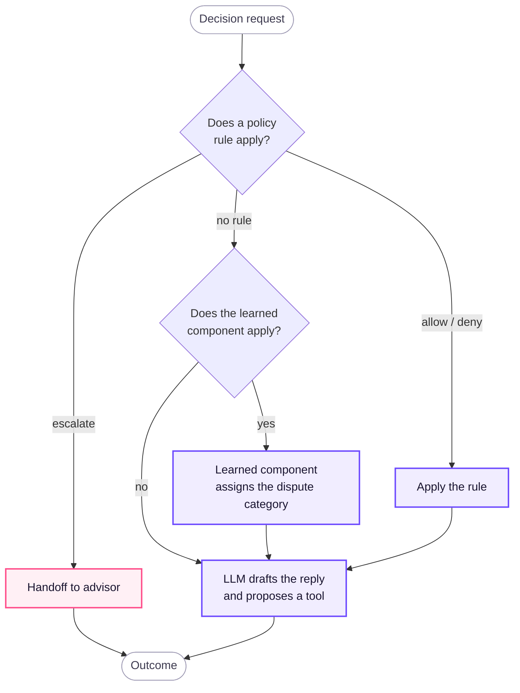

# Architecture Specification

This page gives the contracts and rules behind the [System Architecture](system-architecture.md) and the [Demo Architecture](demo-architecture.md). The two architecture pages show the shape. This page specifies how each part behaves. Requirements have the form `REQ-####` ([requirements](../requirements/requirements.md)). Decisions are in [decisions](../build/decisions/).

## Scope

The entry point is an **account inquiry about charges and transactions**: what a charge is, why it is Declined, Pending or Reversed, and whether the customer can dispute it. Balances, product details, cards and credit are out of scope. The assistant says so and offers a handoff (REQ-0002). This keeps one coherent workflow with one read tool ([008](../build/decisions/008-account-inquiry-scope.md)). The data also cannot support balances or product status ([investigation data support](../rationale/investigation-data-support.md)).

## Service API

One process, one API under `/api/v1`, typed replies in `sentinel-ai-core/app/schemas/chat.py`. Identity comes only from the session cookie. No body and no query accepts `customer_id` (REQ-0007, REQ-0027, REQ-0047).

| Route | Role | What it does |
|---|---|---|
| `POST /api/v1/auth/login` · `logout` · `GET me` | — | Password login against test credentials. The server-side session stores the role. `me` returns the role and the country only |
| `GET /api/v1/transactions` | customer | The charges of the session customer, with the as-of date. Each charge is eligible or not, with the reason key |
| `POST /api/v1/chat` | customer | One turn of the loop. Body: `message` or `selected_reference`. Reply: `text`, `clarification`, `confirm_box`, `case_confirmation`, `handoff` or `error` |
| `POST /api/v1/disputes/preview` · `POST /api/v1/disputes` | customer | The [confirmation](#confirmation) in two calls, on the same turn cycle as the chat. Preview returns the confirm box and writes nothing. Create opens only the previewed charge (409 otherwise) |
| `GET /api/v1/disputes` · `/{id}` | customer | The cases of the customer (disputes and handoff tickets). The case of another customer is a 404 |
| `GET /api/v1/handoffs` · `/{id}` | advisor | Escalated tickets with the full package, and the customer id and country ([009](../build/decisions/009-demo-ui-and-advisor-view.md)) |
| `GET /api/v1/health` | — | Liveness, the active Gold source, the state backend and the active model |

A role failure is a 403, recorded as `access_denied`. The page at `/ui/` is the only client in the demo.

## Orchestrator loop

The loop comes from the hackathon brief: **Understand → Decide → Act → Verify → Escalate** ([flow candidates](../build/flows/01-flow-candidates.md)). Each step has one owner.

| Step | Owner | What happens | Requirements |
|---|---|---|---|
| Understand | LLM and code | The LLM labels the intent (`charge`, `missing`, `out_of_scope`, `person`), the language and the "not mine" claim. Deterministic parsers in code narrow the charges with the words of the customer. The loop asks a clarifying question or abstains when the request is ambiguous or out of scope. | REQ-0001, REQ-0002, REQ-0012 |
| Decide | Code | Applies the [decision priority](#decision-priority): policy, then the learned component, then the LLM. Decides if a dispute applies, needs a confirmation, or goes to a person. | REQ-0006, REQ-0033, REQ-0048 |
| Act | Code (tools) | Calls a session-bound tool. An action that changes state needs an explicit confirmation of the customer first. | REQ-0004, REQ-0042, REQ-0043 |
| Verify | Code (tools) | Reads the result back from the store. The system reports an action only when the read-back succeeds. A timeout is not a success. | REQ-0003, REQ-0005 |
| Escalate | Code (tools) | Builds the JSON handoff when policy requires it, when verification fails after bounded retries, or when the customer asks again for a person. | REQ-0008, REQ-0011, REQ-0040 |

## Tool contracts

Four tools. Each tool is bound to the `customer_id` of the session. The orchestrator gives it. The LLM never gives or sees it ([decision 005](../build/decisions/005-backend.md), REQ-0047). The contracts are documented, so mocks and production backends are interchangeable (REQ-0032).

| Tool | Input (from the LLM or orchestrator) | Output | Guarantees |
|---|---|---|---|
| `lookup_transactions` | Optional filters: date range, merchant hint, amount hint | Candidate charges, each with an opaque candidate id, status (Approved, Declined, Pending, Reversed), amount in the original currency, merchant, date, and the as-of date of the data | Only the charges of the session customer. It never invents a charge (REQ-0003, REQ-0041). |
| `open_dispute` | Candidate id, `confirmation_token`, dispute category (a keyword rule in code, see [learned component](system-architecture.md#learned-component)), customer statement, idempotency key | Dispute id and write status | Validates the mandatory fields of the account country, from configuration (REQ-0049). It asks for a missing field. It does not invent it. It refuses the call without a valid `confirmation_token` for that candidate and session. One record per idempotency key: a retry with the same key returns the existing case (REQ-0026). |
| `lookup_dispute` | Dispute id | The stored record, or not found | The customer gets the case number only when this read succeeds (REQ-0005). |
| `handoff` | Reason for the handoff | JSON package: request, deterministic summary and conversation per turn, verified facts, every action attempted in the session, evidence, open questions, language, country | No raw transcript and no unverified references. No identifiers beyond what the advisor may see (REQ-0008, REQ-0046). Filed as an escalated case. |

The JSON package is the handoff. The service files it as an escalated case. The advisor reads it at `GET /api/v1/handoffs` (role `advisor`) in a read-only view of the same page ([009](../build/decisions/009-demo-ui-and-advisor-view.md)).

### Confirmation

An action that changes state needs an explicit, structured confirmation (REQ-0006). A free-text "yes" is not a confirmation.

1. The orchestrator shows the selected candidate in a confirm box in the chat (`.chat-confirm` in [`branding/chat.css`](../../branding/chat.css)), with the amount, currency, merchant and date.
2. The customer presses confirm. The page sends the candidate id back to `POST /api/v1/chat` as a structured field, not as text.
3. The orchestrator makes a single-use `confirmation_token`, bound to the session, the candidate and the action, with a short expiry.
4. `open_dispute` accepts only that token. The LLM never sees, creates or forwards it.

The disputes API follows the same steps. `POST /api/v1/disputes/preview` is the confirm box, and `POST /api/v1/disputes` is the confirmation. The API refuses a create without a pending preview (409) and writes nothing.

## Decision priority

When more than one component can decide, the higher one wins (REQ-0048):

1. **Policy in code.** Permissions, confirmations and fixed rules. A policy outcome is final.
2. **Learned component.** The intent router labels the request. It never decides eligibility and never overrides a rule. When a dispute applies, a keyword rule in code sets the category that `open_dispute` records.

The policy rules for this flow. The thresholds are country configuration (REQ-0049).

| Rule | Signal available at runtime | Outcome |
|---|---|---|
| Charge is Pending or Reversed | `transaction_status` | Explain the status; no dispute (REQ-0043). |
| Charge is Declined | `transaction_status` | Explain; nothing to dispute. |
| Customer asks for a person | Intent | One offer to help, then a handoff (REQ-0040). |
| Suspected fraud | The customer says that the charge is not theirs (`fraud.claim`), or `fraud_score` is above the threshold of the account country and charge currency (`fraud.score`). The rule never uses `is_fraud`: a bank knows it only after the fact. | Handoff ([010](../build/decisions/010-fraud-handoff-rule.md)). |
| High amount | The charge amount is above the threshold of the account country and charge currency, in the original currency. A currency without a value does not fire. | Handoff ([011](../build/decisions/011-high-amount-threshold.md)). |
| Mandatory information missing after clarification | Country field validation | Handoff with open questions. |
3. **LLM.** Nothing else. Templates and verified Gold facts make the reply. The LLM does not propose tool calls, and it never chooses which data of which customer to read.

## Personal data

**PII** (personally identifiable information) is any data that identifies a customer or is sensitive about the customer: name, national id, account or card numbers, income, credit score, IP address. The rule (REQ-0047): the LLM never receives it, and no restricted data goes to an external model.

The target enforces this with **data minimization at four boundaries**, all in code:

| Boundary | Control | Status |
|---|---|---|
| Gold → service | The service reads a serving view without personal columns. Names and credit score stay in the data layer. | Built: the pipeline writes `v_service_dispute_eligible_transactions` and ran end to end locally. The DuckDB adapter reads only that view. |
| Customer text → service | Code replaces personal identifiers that the customer types (documents, cards, CLABE, CPF, CUIT, RFC, email, phone near a trigger word) with typed markers at the API boundary. This happens before the orchestrator, the model, the logs and the stored conversation (`app/privacy/`). | Built: `tests/privacy/`; adversarial `A9` blocked |
| Tools → LLM | Tools return only the fields that the reply needs (amount, currency, merchant, date, status, opaque candidate id). The orchestrator gives `customer_id` to the tools and never returns it. | Target contract |
| Logs | No customer text and no clear `customer_id`. The session is a salted hash. | Target contract |

In the demo, the masking is not reversible. No tool needs the original value, so there is no token vault. Static masking in Silver stays proposed ([decision 004](../build/decisions/004-pii-lifecycle.md)). The fraud score is not personal data, but it also never goes to the model ([what the model never receives](../rationale/model-data-minimization.md)). Rules: [security](../build/security.md).

## Failure handling

A failure ends in a safe answer or a handoff, never in an unverified claim (REQ-0021, REQ-0026).

| Failure | Behaviour |
|---|---|
| Gold unavailable | Tell the customer that the lookup is not available. Offer a handoff. Do not guess charges. Three Gold timeouts end in a handoff with no case number. |
| Gold older than expected | Answer with the as-of date ("updated through…"). Never claim a newer state (REQ-0039). The staleness rule is off in the demo, where the age of Gold is always zero. Production sets a threshold per country ([014](../build/decisions/014-data-staleness.md)). |
| Dispute write or read-back fails or times out | Retry with the same idempotency key, bounded. If the case is still not verified, hand off with the attempt in the handoff. Do not give a case number. |
| LLM error or timeout | Bounded retry. Then the keyword baseline answers that turn, and the turn log records `fallback` as the route. The customer sees no error. |
| Request that policy refuses | The policy engine refuses it and logs the rule. The reply explains the rule from the stored decision. |
| Session missing or expired | No tool runs. The customer must log in again (REQ-0027). |
| Prompt injection in customer text | No effect on permissions: the tools are session-bound and the policy is in code. Code refuses prompt extraction and records injection attempts. The failure tests cover it (REQ-0021). |

## Language and locale

- The reply language follows the customer (`es-419` or `pt-BR`). The currency follows the account. Amounts are in the original currency of the charge (REQ-0041).
- The assistant understands and explains local acronyms and terms ([glossary](../glossary/), REQ-0044).
- The country (MX, CO, AR) is configuration, not code (REQ-0049). The dataset has no Portuguese text, so the `pt-BR` cases are team-generated and have that label (REQ-0012, REQ-0013).

## Conversation state

The orchestrator keeps the context per session. The LLM does not (REQ-0001).

- **Contents:** the last turns (bounded window), the candidates shown, the pending confirmation, the detected language and the clarification count.
- **Storage:** outside the process, in the relational store (SQLite in the demo), with a hash of the session token as the key. A restart keeps it.
- **History:** one structured entry per turn (what the customer did, the verified charge, the reply, the rule) and every attempted step. It feeds the handoff summary. It never contains the words of the customer. Only the bounded turn window does, for the model.
- **Lifetime:** the same as the session. Logout or expiry deletes the state. The next message needs a new session (REQ-0027).
- **What the LLM gets:** the masked message, the bounded window of turns and a deterministic digest. Never the session, the candidate internals or Gold rows.

## Policy source

The policy engine (`app/policy/`) evaluates the rules in code. It also applies the [decision priority](#decision-priority). The parameters (status explanations, fields per country, deadlines and thresholds) are in one versioned configuration file per country (`config/policy/`), not in code and not in prompts (REQ-0007, REQ-0049). A new country changes the configuration only.

- **Contents:** the meaning of each transaction status and whether it is disputable; the mandatory dispute fields; the filing deadlines; the handoff thresholds per account country and charge currency, each with its source ([010](../build/decisions/010-fraud-handoff-rule.md), [011](../build/decisions/011-high-amount-threshold.md); staleness stays off, [014](../build/decisions/014-data-staleness.md)).
- **Traceability:** each entry has an id. A reply that explains a rule cites it. The log records it as `policy_rule` (REQ-0029).
- **Label:** the dataset has no bank policy. So the file is a **synthetic policy** that the team wrote, and it has that label (REQ-0031).

## Data contract

`lookup_transactions` reads one Gold serving view, `v_service_dispute_eligible_transactions` (the PII-free projection of `gold_dispute_eligible_transactions`), through the `GoldTransactions` seam: a DuckDB adapter, or the labelled mock when the view is not readable. The pipeline in `sentinel-data-engine/` owns the schema contracts, the quality checks, the deduplication and the lineage (REQ-0015). The [data](../build/areas/data.md) page gives the details.

- **Columns used:** transaction id, customer id (filter only, never returned to the LLM), date, amount, currency, merchant, status, `fraud_score`.
- **Eligibility columns from Gold:** `is_disputed`, `days_since_transaction`, `is_eligible_for_dispute` (90-day window). Gold calculates `days_since_transaction` when it builds, so the value gets old between runs. The policy engine calculates the window again from the transaction date at request time. It uses the Gold flag only as a hint.
- **Not visible to the service:** the customer name and the credit score, which the source table carries (see [personal data](#personal-data)). The view still carries `is_fraud` and the segment. The adapter does not read them, and nothing uses `is_fraud` as a signal.
- **As-of date:** the latest processed `process_date` in Gold, returned with every read (REQ-0039).
- **Update correctness:** a labelled two-batch fixture with a late arrival, a duplicate and a new column proves the incremental processing (REQ-0018, `sentinel-data-engine/tests/test_incremental_fixture.py`).

## Observability

Each step of each turn writes one structured log record (REQ-0025). The same records feed tracing, monitoring and the [evaluation](#evaluation) metrics. There is no separate instrumentation.

| Field | Purpose |
|---|---|
| `trace_id` | One per turn; joins LLM calls, tool calls and the reply |
| `session_ref` | Salted hash of the session; never the `customer_id` |
| `step` | Loop step: understand, decide, act, verify, escalate |
| `tool`, `outcome`, `attempt` | Tool called, result (ok, rejected, failed, timeout) and retry number |
| `policy_rule` | Id of the rule that decided, from the [policy source](#policy-source) |
| `latency_ms` | Per step and per turn, for p50/p95 |
| `model`, `route`, `prompt_version` | Reproducibility and experiment tracking (REQ-0019) |
| `tokens_in`, `tokens_out`, `cost_usd` | Cost per attempted case and per resolution (REQ-0055) |
| `language`, `country` | Breakdown and monitoring by segment (REQ-0024, REQ-0050) |

The logs hold no clear customer text and no clear identifiers. An explanation of a decision cites the rule, the tool result or the log record, never the reasoning of the model (REQ-0029).

## Evaluation

We measure the system offline on held-out, labelled conversations, with the same harness for the system and the baseline (REQ-0020, REQ-0022, REQ-0055).

- **Cases:** a versioned JSONL file. Each case has the language, the country, the session, the customer turns, the expected outcome (resolve, explain, clarify, abstain, escalate), the expected category and whether a handoff is required. The text is model-written in `es-419` and `pt-BR`, with that label.
- **Mix:** normal, ambiguous or unsupported, human-required, and the failure set of REQ-0021: wrong or missing data, expired session, access to the charge of another customer, prompt injection, tool failure, multilingual ambiguity.
- **Runner:** replays each case against `POST /api/v1/chat` with a test session and fault injection in the tools. Then it reads the log records by `trace_id`. Repeated runs measure the variability.
- **Baseline:** the same cases with the keyword baseline in place of the learned component.

| Metric (brief) | Computed as |
|---|---|
| Safe automated resolution | In-scope cases with the correct, policy-compliant outcome and no handoff ÷ all in-scope cases; plus the share where automation was attempted |
| Containment | Cases ended without handoff ÷ all cases (reported, not used as success) |
| Escalation quality | Missed and unnecessary handoffs against the expected label; handoff package completeness |
| Unsafe outcomes | Unauthorized disclosure or action, or materially wrong outcome, with count and denominator |
| Operating efficiency | p50/p95 end-to-end latency; cost per attempted case and per safe resolution ("not defined" when there are none) |

Each metric has a breakdown per language and country, with n. The intent accuracy per variant is in [`2024Q4-eval-v7`](../../evidence/evaluation-runs/2024Q4-eval-v7/summary.json). The system outcomes per variant and country are in [`2024Q4-resolution-v2`](../../evidence/evaluation-runs/2024Q4-resolution-v2/summary.json) (`system.<version>.by_variant`, `by_country`). The results are frozen in `evidence/` ([index](../../evidence/README.md)) and have the label "offline simulation", never "production improvement".

## Data retention

REQ-0027. Proposed. Confirm with [security](../build/security.md#data).

| Data | Demo | Production (proposed) |
|---|---|---|
| Conversation state | SQLite, deleted on logout and on session expiry; orphans purged at login | Deleted on session expiry |
| Log records | Local file; on the public link also Log Analytics (30 days unless changed). No customer text. | Centralized, 90 days, no customer text |
| Dispute records (case store) | SQLite | Kept per the bank's regulatory retention |
| Handoff packages | The response, the log and the case store (`kind=handoff`) | With the case |
| LLM provider | No retention, no training use | Same, contractual |

## Capacity

REQ-0053. The demand in the development window: `disputes.unrecognized_claim` and `accounts.reason_transaccional` in the [flow measurements](../build/flows/02-flow-measurements.md), which also gives the figures per day. The prototype is sized for that order of magnitude.

- **Prototype limit:** one process on one SQLite file. The rate limit and the usage cap of the LLM provider limit the throughput. State survives a restart, but more than one instance needs PostgreSQL and shared login-attempt counters. No load test measures the requests per second of one replica yet.
- **At real volume:** more replicas of the same process on PostgreSQL (state is already outside the process), LLM quotas per route, and Gold served from Databricks SQL.

## Trade-offs

REQ-0056. Where we use AI and where we do not.

| Axis | Choice | Why |
|---|---|---|
| Autonomy | Low by design: a confirmation for every write, a handoff on policy triggers | A wrong dispute or a missed fraud case costs more than a handoff |
| Accuracy | Policy and status from code and data. The LLM only labels the intent and the language. | Deterministic where rules exist. The LLM where language is the problem. |
| Latency | One LLM call per text turn, to understand. Templates make the reply. Tools are local reads. | Keeps p95 bounded. The loop has no open-ended agent chains. |
| Cost | One small open-weight model on both routes ([016](../build/decisions/016-router-models.md)) | The cost per resolution is a reported metric |
| Human oversight | A structured handoff with verified facts and open questions | The advisor starts from evidence, not from a transcript |

## Path to production

REQ-0052. Cloud deployment is not mandatory (REQ-0035). The demo runs the same code. [Mocked components](demo-architecture.md#mocked-components) and [what is real](what-is-real.md) list the mocks. This table lists only what must change, or what we must decide, before operation. The [sizing and capacity specification](../sizing-capacity.md) gives the volumes, the prototype capacity and the scaling plan (REQ-0053).

| Area | Work before production |
|---|---|
| Identity | Replace the test session with an identity provider. Move the secrets to Azure Key Vault. |
| Case store, sessions and conversation state | The demo keeps SQLite on an Azure Files share, one replica, `DELETE` journal mode. Production moves to PostgreSQL (same models, a URL change) for more than one instance, and shares the login-attempt counters. |
| Gold serving | Decide how the service reads Gold at request time (not decided; see [stack](system-architecture.md#stack-and-deployment)). Deploy the Gold build to Databricks. |
| Policy | Replace the synthetic configuration with the approved policy of the bank, in the same format: values per currency, `source` set to the bank policy, `synthetic: false`. Decide the staleness threshold ([014](../build/decisions/014-data-staleness.md)). Each decision already records the version of the policy file. |
| Handoff | Publish each ticket to a queue (for example Azure Service Bus) that creates it in the CRM of the bank, routed by language and specialty (REQ-0046). The same package format ([015](../build/decisions/015-handoff-delivery.md)). |
| Personal data | The serving view without personal columns and the free-text masking are built. Add a token vault if a tool needs the original value, and static masking in Silver if adopted ([decision 004](../build/decisions/004-pii-lifecycle.md)). |
| Serving | The submission runs one container on Azure Container Apps, one replica, with the state on an Azure Files share ([019](../build/decisions/019-azure-container-apps.md)). Production keeps the same service with autoscaling, Key Vault and PostgreSQL. |
| LLM | Serve the chosen open-weight model on Azure AI Foundry or Databricks, with quotas per route and a spend cap ([016](../build/decisions/016-router-models.md)). Add a daily spend guard with a fallback to the baseline. |
| Observability | The demo writes each turn record as one JSON line on standard output when enabled. Container Apps sends it to Log Analytics. Production adds central traces and alerts per country (REQ-0050). OpenTelemetry stays that path. |
| Evaluation | Run the same harness as a release gate. Add a load test of `/api/v1/chat`. |
| Data retention | Confirm the proposed retention periods ([data retention](#data-retention)) |

The [cost](../build/cost.md) page tracks the deployment cost.
