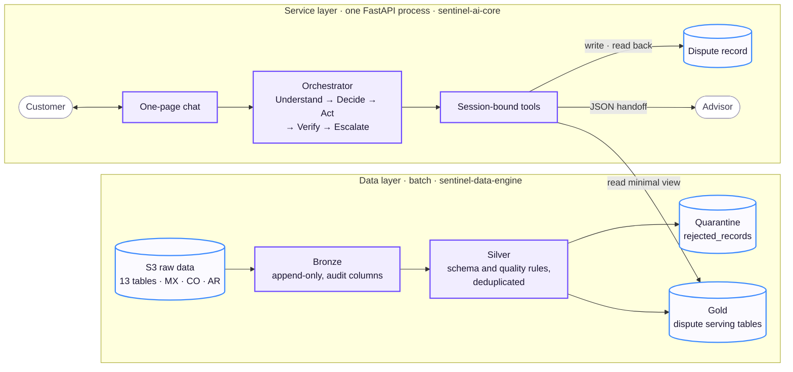
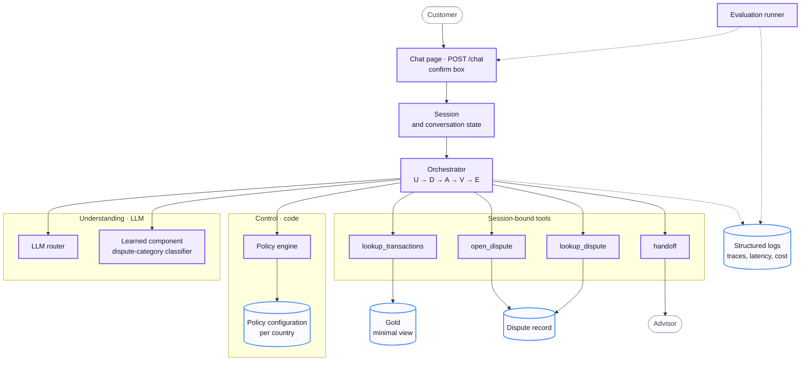
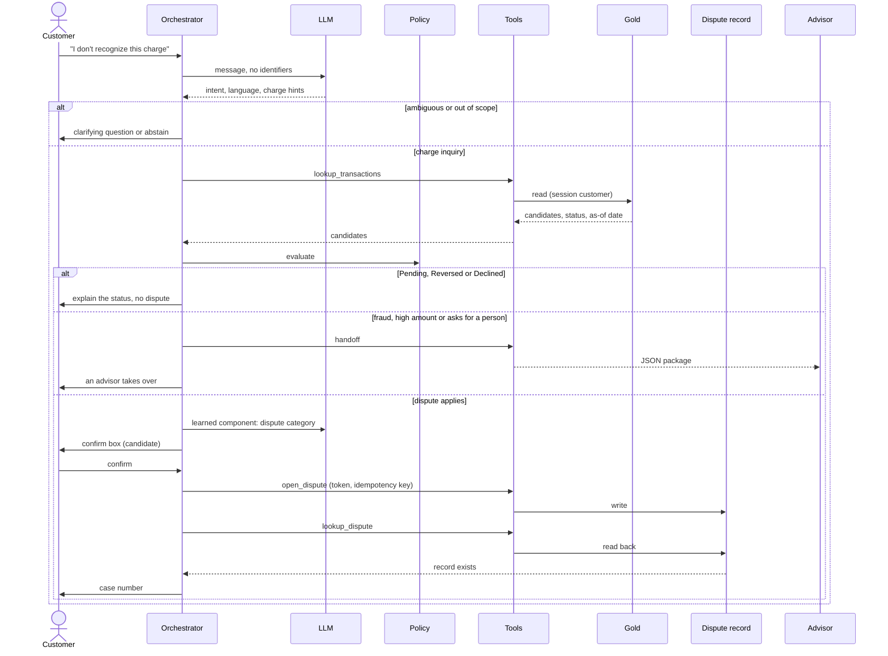
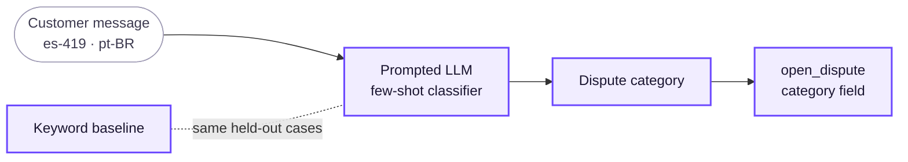
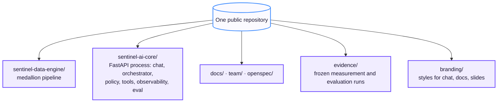

# System Architecture

Target architecture of Sentinel Engine for the transaction-disputes flow: an account inquiry about a charge that becomes a dispute only when it has to. The [Demo Architecture](demo-architecture.md) has the same sections and diagrams, with the mocked parts marked. Behaviour and contracts are in the [Architecture Specification](specification.md).

Legend for every diagram: violet = component, blue = data store, grey = outside the system.

## Central principle

**AI understands; code executes and verifies.** The LLM interprets the customer and drafts replies. Permissions, confirmations, actions and their verification live in code. The loop is the one the hackathon asks for: **Understand → Decide → Act → Verify → Escalate**.

## Layers

- **Data layer.** Batch medallion pipeline. Bronze keeps the files as received; Silver enforces the schema contracts and quality rules and sends invalid rows to quarantine instead of dropping them; Gold holds denormalised tables ready to serve. The service reads Gold and never writes to it.
- **Service layer.** One process serves the chat page and `POST /chat`; there is no second app and no advisor screen.
- **Two stores, two jobs.** Charges are read from Gold, which the pipeline refreshes in batches. Disputes are written to an operational dispute record and read back at once, so the customer only hears a case number that exists.

## Components

| Component | Role |
|---|---|
| Chat page and `POST /chat` | The customer's only entry point. State-changing actions are confirmed with a confirm box, not with free text. |
| Session and conversation state | Trusted session that carries `customer_id`; recent turns and pending confirmation, deleted when the session expires. |
| Orchestrator | Runs the loop and owns every call. It injects `customer_id` into tools; the LLM never sees or chooses it. |
| LLM router | Sends each LLM call to a model by route. Understands intent, language and the charge; drafts the reply. |
| Learned component | See [below](#learned-component). |
| Policy engine and configuration | Evaluates rules in code (status, eligibility, confirmation, handoff triggers) with per-country parameters from configuration. A policy outcome is final. |
| Tools | Four functions bound to the session: look up charges, open a dispute (idempotent), read it back, hand off. |
| Dispute record | Operational store for disputes. Relational; the engine is not decided (SQLite and PostgreSQL are candidates). Never Gold. |
| Structured logs | One record per loop step, used for tracing, monitoring and evaluation metrics. |
| Evaluation runner | Replays labelled conversations against `POST /chat` and computes the metrics the brief asks for. |

## Walkthrough of a case

A timeout is not success: if the read-back fails after bounded retries, the case is handed off and no case number is given.

## Learned component

The one learned component is a **dispute-category classifier**: a prompted LLM with few-shot examples that reads the customer's message and assigns the dispute category, using the category and subcategory values of the `complaints` table (for example, the subcategory *Cargo no reconocido*, "unrecognized charge").

- **Where it runs:** in Decide, only after policy has established that a dispute applies.
- **What it decides:** the category recorded in the dispute. It never decides eligibility and never overrides a rule.
- **How it is judged:** against a keyword baseline and the same LLM zero-shot, on the same held-out conversations. Because the dataset has no usable customer text, those conversations are team-written in `es-419` and `pt-BR` and declared as such.

## Stack and deployment

| Piece | Target |
|---|---|
| Platform | Azure; Linux for local development |
| Backend | Python and FastAPI, one process; loop implementation (LangGraph or plain Python) deferred |
| Frontend | One-page chat served by the same process, styled with the `branding/` files |
| Data pipeline | Delta Lake: DuckDB locally, Azure Databricks in production, same `sentinel_data` package |
| Gold serving | Not decided. The Databricks pipeline is implemented in code (Asset Bundle, Bronze and Silver jobs), but Gold on Databricks is meant for historical analytics, so the read path at request time is open |
| Dispute record | Relational store, engine not decided (SQLite and PostgreSQL are candidates) |
| LLM | Hybrid router; model per route not decided |
| Identity and secrets | Identity provider; Azure Key Vault |
| Serving | Azure Container Apps, autoscaled |
| Observability | Centralised logs and traces, alerts by country |

## Repository layout

Two code folders. Components are folders, not services: no second HTTP service for the model and no separate web package. Owners and progress per folder are in the team plan.

## References

- Specification of every contract and rule: [Architecture Specification](specification.md)
- Pipeline detail: [data area](../build/areas/data.md), [`sentinel-data-engine/`](../../sentinel-data-engine/README.md)
- Learned component: [decision 007](../build/decisions/007-learned-component.md), [ML area](../build/areas/ml.md)
- Why this flow: [flow selection](../build/flows/03-flow-selection.md), [decision 003](../build/decisions/003-disputes-flow.md), [decision 008](../build/decisions/008-account-inquiry-scope.md)
- Stack decisions: [001](../build/decisions/001-azure-platform.md), [005](../build/decisions/005-backend.md), [006](../build/decisions/006-frontend.md); open ones in [pending decisions](../../team/pending-decisions.md)
- Owners and progress: [folders](../../team/plan.md#folders)
