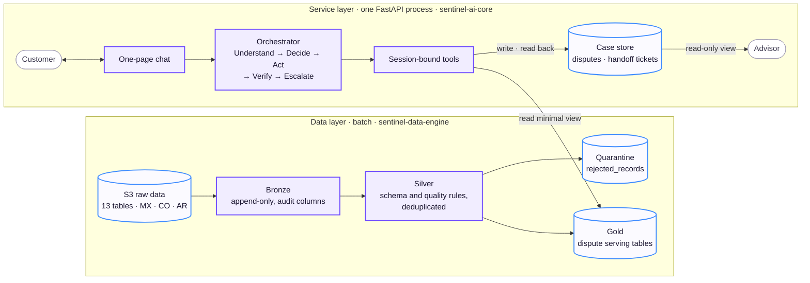
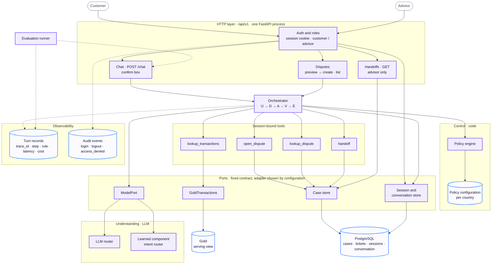
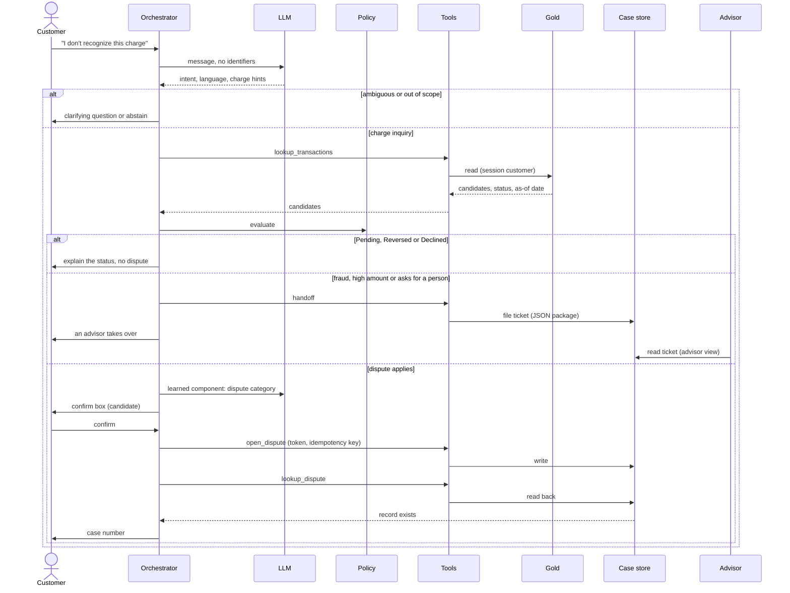
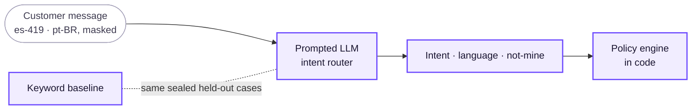
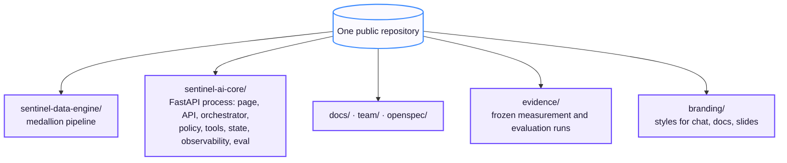

# System Architecture

This page shows the target architecture of Sentinel Engine for the transaction-disputes flow: an account inquiry about a charge that becomes a dispute only when necessary. The [Demo Architecture](demo-architecture.md) has the same sections and diagrams, with the mocks marked. The [Architecture Specification](specification.md) gives the behavior and the contracts.

Legend for every diagram: violet = component, blue = data store, grey = outside the system.

## Central principle

**AI understands; code executes and verifies.** The LLM labels what the customer says. Templates and verified Gold facts make the reply. Permissions, confirmations, actions and their verification are in code. The loop is the one that the hackathon asks for: **Understand → Decide → Act → Verify → Escalate**.

## Layers

- **Data layer.** A batch medallion pipeline.
  - Bronze keeps the files as received.
  - Silver enforces the schema contracts and the quality rules. It sends invalid rows to quarantine. It does not drop them.
  - Gold holds denormalized tables, ready to serve.
  - The service reads Gold and never writes to it.
- **Service layer.** One process serves the page and the API (`/api/v1`). There is no second app. The advisor reads escalated tickets in a read-only view of the same page ([009](../build/decisions/009-demo-ui-and-advisor-view.md)).
- **Two stores, two jobs.** The service reads charges from Gold. The pipeline refreshes Gold in batches. The service writes disputes and handoff tickets to an operational case store and reads them back at once. So the customer gets only a case number that exists. Sessions and conversation state are in the same relational store, outside the process.

## Components

| Component | Role |
|---|---|
| HTTP layer: auth and roles | Every route is under `/api/v1`, behind the session cookie. Login needs a password. The role on the session decides which routes answer (customer: chat, transactions, disputes; advisor: handoffs). A role failure is a 403, recorded as `access_denied`. |
| Chat page and `POST /api/v1/chat` | The entry point of the customer. A confirm box confirms each action that changes state. Free text does not. |
| Disputes API | `/api/v1/disputes`: the same dispute workflow without chat, in two steps (preview = confirm box, create = confirmation) on the same orchestrator turn, and the list of the cases of the customer. It is not a second business path. |
| Session and conversation state | A trusted session (password login, stored role) that carries `customer_id`. Recent turns, the pending confirmation and a history per turn, outside the process. Logout or expiry deletes them. |
| Orchestrator | Runs the loop and makes every call. It gives `customer_id` to the tools. The LLM never sees or chooses it. |
| LLM router | Sends each LLM call to a model per route. It labels the intent, the language and the "not mine" claim. It does not write the reply. |
| Learned component | See [below](#learned-component). |
| Policy engine and configuration | Evaluates rules in code (status, eligibility, confirmation, handoff triggers) with parameters per country from configuration. A policy outcome is final. |
| Tools | Four functions bound to the session: look up charges, open a dispute (idempotent, one open dispute per charge), read it back, hand off. |
| Case store | An operational relational store (PostgreSQL) for disputes and handoff tickets, and for sessions and conversation state. Never Gold. |
| Handoffs route and advisor view | `GET /api/v1/handoffs`, role `advisor`: each escalated ticket with its reason, summary, verified facts, actions attempted and open questions. Read-only ([009](../build/decisions/009-demo-ui-and-advisor-view.md)). |
| Ports and adapters | Four contracts that the code uses: `ModelPort` (understanding), `GoldTransactions` (charges), the case store (disputes and tickets), and the session and conversation store. Configuration selects the adapter behind each one, so the demo and production run the same loop. |
| Observability | Turn records (one per loop step and one closing record per turn: `trace_id`, rule, latency, cost) and audit events (login, logout, `access_denied`). They hold no customer text and no clear identifier. They serve tracing, monitoring and the evaluation metrics. |
| Evaluation runner | Replays labelled conversations against `POST /api/v1/chat` and calculates the metrics that the brief asks for. |

## Walkthrough of a case

A timeout is not a success. If the read-back fails after the bounded retries, the case goes to a person, and the customer gets no case number.

## Learned component

The one learned component is an **intent router**: a prompted LLM with development examples. It reads the masked message of the customer and returns a bounded JSON label ([016](../build/decisions/016-router-models.md), [018](../build/decisions/018-evaluation-acceptance.md)):

- the intent (`charge`, `missing`, `out_of_scope`, `person`),
- the language,
- whether the customer says that the charge is not theirs.

It refines [007](../build/decisions/007-learned-component.md), which first proposed to classify the dispute category. A keyword rule in code sets the category of a dispute.

- **Where it runs:** in Understand, after the masking and after the code checks that refuse prompt extraction and record injection attempts. Deterministic parsers, not the model, narrow the list of charges.
- **What it decides:** only the label. Policy, eligibility, the confirm box, the read-back and the handoff stay in code. When the model fails, the baseline answers that turn.
- **How we judge it:** against the keyword baseline on the same sealed held-out set, measured once ([`2024Q4-eval-v7`](../../evidence/evaluation-runs/2024Q4-eval-v7/summary.json): intent accuracy 0.9821 against 0.5393, n = 280, `component.versions.<version>.breakdown.overall`), and end to end on the multi-turn resolution set ([`2024Q4-resolution-v2`](../../evidence/evaluation-runs/2024Q4-resolution-v2/summary.json)). The cases are model-written simulation in `es-419` and `pt-BR`, and we say so.

## Stack and deployment

| Piece | Target |
|---|---|
| Platform | Azure; Linux for local development |
| Backend | Python and FastAPI, one process. The loop is plain Python; LangGraph stays deferred ([005](../build/decisions/005-backend.md)). |
| Frontend | One page served by the same process (customer chat and read-only advisor view), styled with the `branding/` files |
| Data pipeline | Delta Lake: DuckDB locally, Azure Databricks in production, same `sentinel_data` package |
| Gold serving | Not decided. The Databricks pipeline is in the code (Asset Bundle, Bronze and Silver jobs). Gold on Databricks is for historical analytics, so the read path at request time is open. |
| Case store | PostgreSQL: disputes, handoff tickets, sessions, conversation state |
| LLM | Open-weight model per route (GLM 5.3 Flash on both routes today), served on Azure AI Foundry or Databricks, with the keyword baseline as the fallback ([016](../build/decisions/016-router-models.md)) |
| Identity and secrets | Identity provider; Azure Key Vault |
| Serving | Azure Container Apps, autoscaled |
| Observability | Central logs and traces, alerts per country |

## Repository layout

Two code folders. Components are folders, not services: there is no second HTTP service for the model and no separate web package. The team plan gives the owners and the progress per folder.

## References

- Specification of every contract and rule: [Architecture Specification](specification.md)
- Pipeline detail: [data area](../build/areas/data.md), [`sentinel-data-engine/`](../../sentinel-data-engine/README.md)
- Learned component: [decision 007](../build/decisions/007-learned-component.md), [ML area](../build/areas/ml.md)
- Why this flow: [flow selection](../build/flows/03-flow-selection.md), [decision 003](../build/decisions/003-disputes-flow.md), [decision 008](../build/decisions/008-account-inquiry-scope.md)
- Stack decisions: [001](../build/decisions/001-azure-platform.md), [005](../build/decisions/005-backend.md), [006](../build/decisions/006-frontend.md), [009](../build/decisions/009-demo-ui-and-advisor-view.md); open ones in [pending decisions](../../team/pending-decisions.md)
- Owners and progress: [folders](../../team/plan.md#folders)
