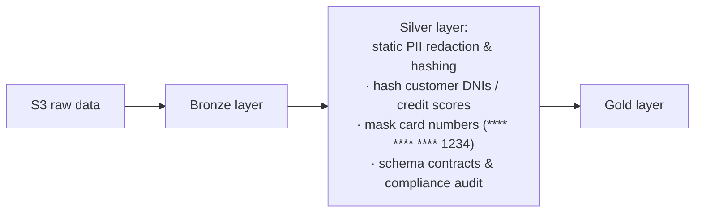
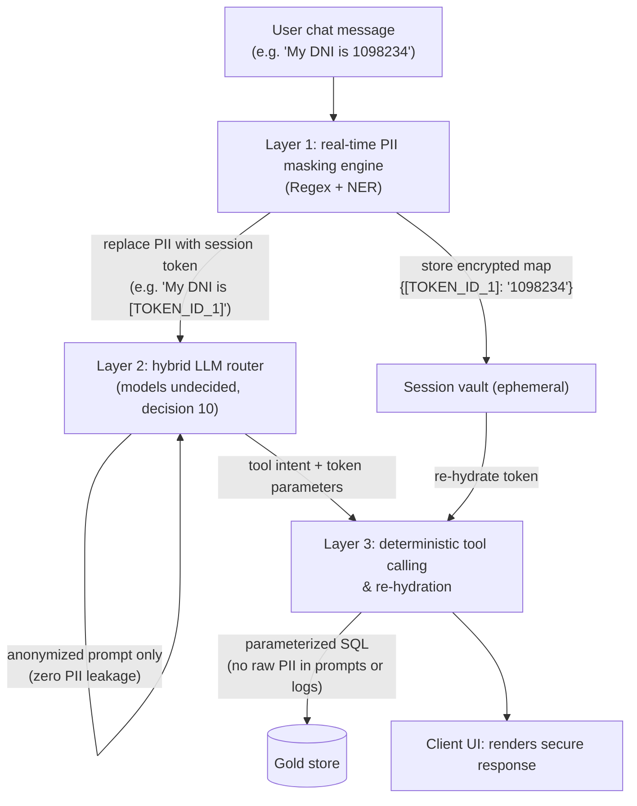
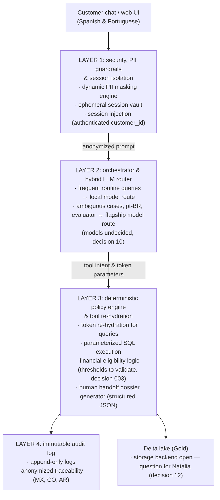
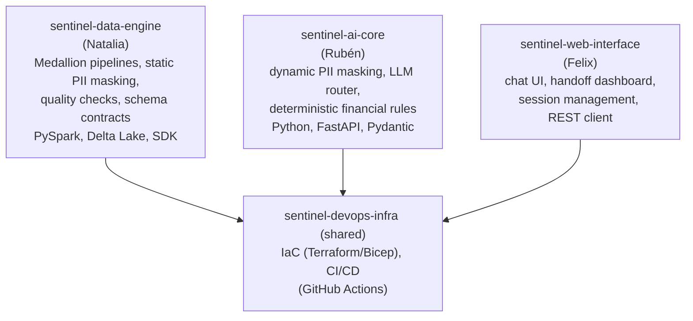
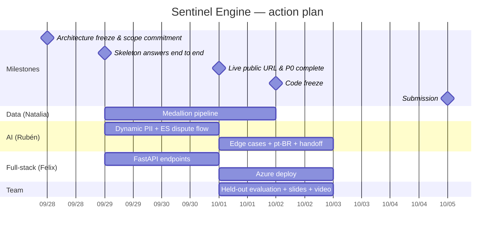

# Architecture and roadmap

Sentinel Engine — architecture, PII lifecycle and action plan. Source: Natalia's proposal (9/28), translated and reconciled with the repository. Everything stated here as decided is backed by a linked decision or requirement; proposals still pending carry a callout with their decision number.

> Project: Sentinel Engine — Factored AI & Data Hackathon 2026
> Workflow focus: transaction-dispute intake (Spanish & Portuguese), as working hypothesis ([decision 003](decisions/003-disputes-flow.md), provisional until the Tuesday 9/29 review)
> Submission: Monday, October 5 (time to be confirmed)
> Internal goal: everything ready Friday, October 2; the weekend is buffer
> Team: Natalia Restrepo (data), Rubén Dorta (AI, architecture, ML), Felix Uchubanda (full-stack)

## Executive summary

Sentinel Engine is an enterprise-grade AI banking assistant for processing transaction disputes across Latin America (Mexico, Colombia and Argentina).

**Guiding principle: AI understands; code executes and verifies.** The LLM handles comprehension, intent extraction and multilingual dialogue. Financial decisions, identity authorization, dispute eligibility thresholds and claim creation are enforced by deterministic code and backend APIs. Same principle as [architecture](../understand/architecture.md#central-principle), which stays the canonical reference for layers and walkthroughs.

## PII lifecycle

PII management spans data engineering, AI/agent engineering and full-stack, across two planes (see [decision 004](decisions/004-pii-lifecycle.md), proposed).

### Plane 1: data at rest (batch / lakehouse) — Natalia

> [!NOTE]
> Proposed, not implemented. Static masking is recorded in [security](security.md#data) as Natalia's 9/28 proposal.

### Plane 2: data in flight (real-time chat) — Rubén & Felix

> [!NOTE]
> Proposal without implementation yet — no code, tooling undecided (Presidio vs Regex/SpaCy), retention policy pending. Tracked in [decision 004](decisions/004-pii-lifecycle.md).

| Domain | Responsibility | Owner | Tools |
|---|---|---|---|
| Data engineering (at rest) | Static masking and hashing in the Silver layer, so analysts and batch ML never see raw credentials | Natalia Restrepo | PySpark, Delta Lake column masking, hash functions |
| AI / agent engineering (in flight) | Dynamic prompt masking and unmasking: tokenize before LLM calls, keep the ephemeral map, re-hydrate for tool calls | Rubén Dorta | Python, Presidio / Regex / SpaCy NER, session token vault |
| Full-stack / backend (session security) | Secure transport and UI rendering: `customer_id` via headers/JWT, no PII in browser logs or client storage | Felix Uchubanda | FastAPI, JWT, HTTPS/TLS |

## System architecture (4 layers)

> [!NOTE]
> Layer 2 models are undecided (decision 10, due Tue 9/29). Layer 4 storage backend is an open question for Natalia (decision 12: local DuckDB vs Databricks options). The >90-day eligibility cutoff is a valid working rule but must be validated against the data ([decision 003](decisions/003-disputes-flow.md)).

## Repository layout

> [!WARNING]
> Pending (decision 21): separate-by-domain repos vs a single repo. The submission requires a single public repository, so if development splits across repos, the delivery repo and who assembles it must be defined before go-live. The current repository is a single repo.

## Action plan (deadline Monday 10/5, time TBD)

Notes:

- Video and slides start **no earlier than Oct 1** (likely Oct 2); the weekend of Oct 3–5 is buffer for corrections only, with early submission.
- Portuguese test cases: source and reviewer still to define, owner TBD (decision 15). Vocabulary lives in [glossary.pt-br.md](../understand/glossary/glossary.pt-br.md).
- Submission time and channel are unconfirmed (asked in the hackathon help channel); until confirmed, assume Monday 10/5 EOD.

## Cost matrix (MVP budget)

Working assumption (decision 16: USD 20–58 within the USD 200 trial credit), **pending validation against Azure pricing**.

| Component | Open source / free tier | Paid cloud (Azure / Databricks) | Estimated MVP cost |
|---|---|---|---|
| Compute & API server | FastAPI (local dev) | Azure Container Apps / Web App | USD 0–13 |
| LLM inference | Ollama / vLLM (local Llama 3) | Azure OpenAI (token usage) | USD 10–25 |
| Data lakehouse | DuckDB / local Delta Lake | Azure Databricks (single-node cluster) | USD 10–20 |
| PII & safety | Microsoft Presidio / Regex | Azure AI Content Safety | USD 0–2 |
| Storage & secrets | Local `.env` | ADLS Gen2 + Azure Key Vault | USD 0–2 |
| CI/CD & DevOps | GitHub Actions (free minutes) | GitHub Actions runner | USD 0 |
| **Total** | — | — | **USD 20–58 (covered by USD 200 credit)** |

## Appendix: alignment with the repository

| # | Claim | Repo status |
|---|---|---|
| 1 | Focus: transaction-dispute intake ES/PT | Working hypothesis, provisional until Tue 9/29 review ([003](decisions/003-disputes-flow.md)) |
| 2 | Guiding principle | Accepted, canonical in [architecture](../understand/architecture.md#central-principle) |
| 3 | Domain owners Natalia / Rubén / Felix | Accepted ([plan](../../team/plan.md)) |
| 4 | Static masking in Silver | Proposed by Natalia (9/28), recorded in [security](security.md#data), not implemented |
| 5 | Dynamic masking: token vault + re-hydration | Proposed, no code yet ([004](decisions/004-pii-lifecycle.md)) |
| 6 | Hybrid router model choice | Undecided (decision 10, due Tue 9/29) |
| 7 | Storage backend | Open question for Natalia (decision 12) |
| 8 | Multi-repo development layout | Pending (decision 21); conflicts with the single-public-repo submission requirement |
| 9 | MVP cost USD 20–58 | Working assumption, pending Azure validation (decision 16) |
| 10 | Deadline Mon 10/5, internal goal Fri 10/2 | Accepted; submission time/channel unconfirmed |
| 11 | Eligibility thresholds (e.g. >90-day cutoff) | Valid working rules, must be validated against data ([003](decisions/003-disputes-flow.md)) |
| 12 | Per-piece stack (Key Vault, Container Apps, frontend) | Proposals under pending decisions 1, 11, 13 |
| 13 | JSON handoff dossier | Defined ([003](decisions/003-disputes-flow.md), REQ-0008) |
