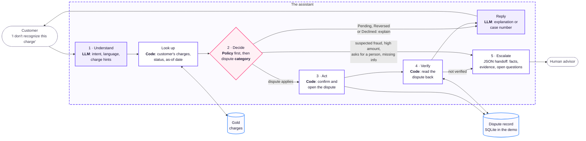

# Flow selection

Why the data supports the chosen flow. Last of three flow documents: [candidate flows](01-flow-candidates.md), [measurements](02-flow-measurements.md) (exact results; every figure below cites one of its fields), and this analysis.

## Conclusion

**Chosen flow: transaction disputes, entered through an account inquiry** ([decision 003](../decisions/003-disputes-flow.md)).

- **Demand sits in inquiries, not in disputes.** 35% of calls are transactional (~213 a day); unrecognized-charge claims are ~2.7 a day (862 a quarter, ~9 a day, if the same subcategory filed as a complaint is counted). The flow therefore starts as an account inquiry and opens a dispute only when it applies.
- **The value of disputes is controlled action.** Look up, confirm, open, verify and hand off with evidence, which is what the brief asks to demonstrate.
- **No flow gives a usable signal from one column.** The learned component is therefore a prompted LLM compared with a keyword baseline on the same held-out cases, not a classifier on tabular fields.

Data used: the development window only (2024-10-01 to 2024-12-31, by event date). Data from 2025-07-01 is reserved for the final evaluation and was not read.

The measured problem behind the flow is in [`evidence/problem/dev-v1`](../../../evidence/problem/dev-v1/README.md) and the [problem and demand](../../rationale/problem-and-demand.md) page: first-contact resolution by reason, calls a day by workflow, and agent hours a month over the whole development zone (2023-06-17 to 2025-07-01).

**Terms.** *Handoff*: passing a case to a human advisor with a structured package. *Held-out*: data kept aside to measure the finished system. *Leak*: a field that already contains the answer or is only known afterwards.

## Method

Each flow answers four questions: demand, operational data, signal for a learned component, and trustworthy labels and text ([criteria](01-flow-candidates.md#comparison-criteria)).

- **Signal test.** For each target, rows are split by one field at a time and the **spread** is taken: the highest group rate minus the lowest (5.0% and 4.5% give 0.5%). Under about 1%, the field says almost nothing about the target. This is a one-field screen; it does not rule out a model that combines fields, and the `*_learnable` flags are fixed in code.
- **Timing constraint.** A field can be a feature only if it exists when the customer writes to the assistant. Fields filled in later (outcome, assignee, response date) tell the model the future: excellent on past data, empty in production.

## Summary

In the order of the brief. *Rank* orders the flows by what the data supports, whatever the decision (1 = strongest).

| # | Flow | Demand | Data to act on | Signal for ML | Labels and text | Rank |
|---|---|---|---|---|---|---|
| 1 | Accounts and payments | **High:** 35% of calls | Good | Flat | Product blank on 60% of transactional calls | **1** |
| 2 | Cards | Not measurable | Fair | Flat | — | 3 |
| 3 | Disputes | Low: ~2.7 claims a day | Good | Flat | Label leak, template text, no link to calls | 2 |
| 4 | Credit | Not measured | Biased snapshot | Flat | — | 4 |

## 1. Accounts and payments

Balances, movements, and why a payment was declined, pending or reversed.

| Measured | Value | Field |
|---|---|---|
| *Transaccional* (transactional) calls | 19,630 of 56,045 = 35.03%, ~213 a day | `accounts.reason_transaccional`, `accounts.n_calls` |
| Transactions: Approved · Declined · Pending · Reversed | 340,929 · 18,652 · 7,316 · 3,762 of 370,659 (91.98% · 5.03% · 1.97% · 1.01%) | `accounts.status_*` |
| Largest spread of the non-approved rate | 0.71% (channel) | `accounts.decline_spread_pp` |
| Transactional calls with a blank product field | 11,776 = 59.99% | `accounts.transaccional_products_blank` |

- **Strongest demand and checkable data.** Every transaction has a status the assistant can read and explain.
- **Almost entirely read-only**, so it shows little action and handoff. No single field separates non-approved transactions (8.02%; spreads 0.5% to 0.71%).
- The blank product field is unexplained, so it is not used to tell which product a call was about.

**Verdict:** best demand and data; supplies the entry point of the chosen flow.

## 2. Cards

Block a lost card or explain a block, with explicit confirmation.

| Measured | Value | Field |
|---|---|---|
| Credit cards in the snapshot | 81,895 | `cards.credit_cards` |
| Products Blocked (all types) | 16,233 = 4.96% of all products | `cards.blocked`, `credit.n_products` |
| Fraud transactions | 366 = 0.10% | `cards.fraud_true`, `accounts.n_transactions` |
| Spread of Blocked by product type | 0.98% | `cards.blocked_spread_pp` |

- **Clear action, thin evidence.** Calls cannot isolate cards: `reason_category` only mirrors `contact_reason` (`accounts.reason_category_degenerate`). Demand is not measurable, which is a gap in the evidence, not proof of zero demand.
- **Fraud is rare and belongs to a person.** 366 cases justify a handoff rule, not training data, and declaring fraud moves money and carries legal weight.
- The 4.96% covers every product type, not only cards.

**Verdict:** the fallback had disputes failed; weak evidence either way.

## 3. Disputes

The customer does not recognize a charge; the assistant finds it, opens a dispute, verifies it and hands off with evidence when it should not act.

| Measured | Value | Field |
|---|---|---|
| *Cargo no reconocido* (unrecognized charge) claims | 251 of 5,611 complaints = 4.47% ±0.54%, ~2.7 a day | `disputes.unrecognized_claim`, `disputes.n`, `dispute_share_pct` |
| `description` contains `category` | 5,611 of 5,611 | `disputes.description_leak` |
| Complaints with `origin_interaction_id` | 0 | `disputes.linkage_filled` |
| Distinct 60-character transcript openings | 2 across 14,023 transcripts | `disputes.text_prefixes`, `disputes.transcripts` |
| Call escalation | 5,635 of 56,045 = 10.05% | `disputes.escalated_calls` |

- **Low demand.** A demo of controlled action, not a volume story.
- **Label leak.** `description` already contains the category, so predicting it from the description would score high for the wrong reason. That classifier is ruled out.
- **No link from call to complaint.** The column exists but is empty, so no share of disputes can be attributed to calls.
- **Text is templated.** Conversations in es-419 and pt-BR are written for the project and labeled as simulation.
- **Banned features (timing constraint).** Closing fields (`resolution`, `closing_date`, `compensation_granted`, `resolution_satisfaction`…) are 0% filled while a case is open; assignment and first-response fields fill in after opening (~50–57% open, ~91–92% closed); `sla_breached` is always filled and carries no signal (`disputes.leak_fill_*`).
- **Flat signal.** Unrecognized-charge claim rate: spread of 0.96% across priority and 4.72% across reception channel, driven by the Regulator channel (46 complaints, 10 of them claims), which the script reads as small-sample noise. Call escalation: spread of 0.65% to 1.59% across channel, type, reason, wait and accent; by agent 0% to 26.7% among agents with ≥20 calls, which the script reads as routing, not customer need (`disputes.cnr_spread_pp`, `disputes.regulator_n`, `disputes.esc_spread_pp`, `disputes.esc_agent_spread_pp`).

**Verdict:** defensible for action, verification and handoff; not for demand and not for a classical model.

## 4. Credit

Explain products and give a simulated eligibility outcome.

| Measured | Value | Field |
|---|---|---|
| Products in the filtered snapshot | 327,035 | `credit.n_products` |
| Products with days past due above 0 | 15,321 = 4.68% | `credit.delinquent` |
| Spread of the share above 30 days past due, three loan types | 0.48% | `credit.delinq_spread_pp` |

- **No demand measured**, and the highest policy risk: the brief requires separating conversation, risk estimate and policy, with fairness and explanations.
- **Biased snapshot.** `products` is one snapshot filtered by `last_updated`: it shows products touched in Q4, not the real portfolio, and holds dates as late as 2027 ([dataset](../../understand/dataset.md)).
- **Flat signal** by loan type.

**Verdict:** discarded.

## Suggested flow

"I don't recognize this charge" starts as an account inquiry about charges and becomes a dispute only when it has to. Balances, products, cards and credit are out of scope ([system: scope](../../architecture/specification.md#scope)). The steps are the loop the brief asks for: Understand → Decide → Act → Verify → Escalate. The full sequence and the tool contracts are in the [system](../../architecture/system-architecture.md#walkthrough-of-a-case); which boxes are mocked is in the [demo](../../architecture/demo-architecture.md#mocked-components).

Legend: violet fill = LLM, violet outline = code, rose = decision (policy and learned component), blue = data store, grey = outside the system. Colours follow [`branding/`](../../../branding/BRANDING.md).

**Why this shape:** demand sits in inquiries (35% of calls), not in disputes (~3 a day); checking the status first avoids needless disputes (3% of transactions are Pending or Reversed); and opening, verifying and escalating with evidence is what the hackathon brief emphasizes.

## Consequences for the design

- **Learned component:** a prompted LLM compared with a keyword baseline on the same held-out cases ([REQ-0016](../../requirements/requirements.md)), on Latin American Spanish (es-419) and Brazilian Portuguese (pt-BR) text written for the project and declared as such. Classifying `category` from `description` is ruled out by the leak.
- **Entry point:** the flow starts as an account inquiry, so the demand of the first option carries the disputes flow. The inquiry is limited to charges and transactions: the demand behind balances and products is not served by this flow.
- **Suspected fraud** is a handoff rule in code, not a model. It uses what exists at runtime (the customer's statement, `fraud_score`), never `is_fraud`, which is a label known after the fact. The threshold is open (decision 25).
- **Learned component placement:** the category it assigns fills the dispute record; it does not decide whether a dispute applies.
- **Evaluation set:** written for the project and labeled as simulation.

## Limitations

- Results describe one quarter (Q4-2024); the text is templated, so conversational results are simulation.
- Spreads test one field at a time. A model combining fields (for example, for call escalation) was not fitted; it would extend the design without changing the flow.
- Demand for cards and credit could not be measured from calls.
