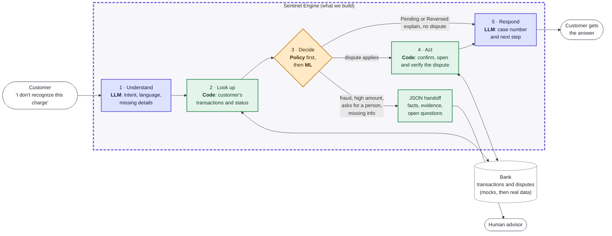

# Flow data evidence

What the Q4-2024 data says about the four candidate flows, as input to the Tuesday 9/29 review of [decision 003](../decisions/003-disputes-flow.md) and pending decision 2 (learned component).

**Purpose:** back the flow choice with measured data (REQ-0014). **Status:** development window only (2024-10-01 to 2024-12-31, event dates); the held-out zone (from 2025-07-01) was not read. **Related:** [flow options](options.md), [dataset](../../understand/dataset.md), [ML](../areas/ml.md).

## Sources

Numbers come from the frozen runs in [`evidence/flows/`](../../../evidence/flows/). Cite their `summary.json` fields, never hand-transcribed values. Percentages below are derived from those counts.

| Run | Folder | Adds |
|---|---|---|
| v1 | [`evidence/flows/`](../../../evidence/flows/README.md) | Volumes, statuses, duplicates, linkage, description leak, transcript variety |
| v2 | [`2024Q4-v2/`](../../../evidence/flows/2024Q4-v2/README.md) | Regulator channel, call escalation, open vs closed field fill, `reason_category` check |
| v3 | [`2024Q4-v3/`](../../../evidence/flows/2024Q4-v3/README.md) | One-field-at-a-time separation audits for each candidate target |

## The four flows

| Flow | Demand | Operational data | Learned component on tabular data | Verdict |
|---|---|---|---|---|
| **1. Accounts and payments** | **High:** 35% of calls are *Transaccional* (19,630 of 56,045; ~213 a day) | Good: transaction statuses (5% Declined, 2% Pending, 1% Reversed) | No single field separates declines (spread ≤ 0.7 pp) | Best demand, but mostly read-only |
| **2. Transaction disputes** | Low: 251 *Cargo no reconocido* (unrecognized charge) claims, 4.47% ±0.54 pp of complaints (~2.7 a day); 862 counting complaints too | Good: same transactions; statuses prevent needless disputes (REQ-0043) | Complaints link to no call (0%); `description` contains `category` in 100% of rows; no single open-time field separates disputes | Defensible for action, verification and handoff, not for demand |
| **3. Card support** | Not measurable: `reason_category` mirrors `contact_reason`, no call subcategory | 81,895 credit cards; 5% of products blocked | Fraud: 366 cases (0.10%); blocked status flat by product type (~1 pp) | Weakest data |
| **4. Credit** | No call demand measured | Snapshot only, biased by the `last_updated` filter | Delinquency flat by product type (~0.5 pp) | Discarded |

## Cross-flow findings

- **No real text.** 14,023 transcripts share only 2 distinct 60-character prefixes: they are templates. Any conversational evaluation in es-419 or pt-BR needs team-generated text, labeled as such (REQ-0031, REQ-0013).
- **Label leak.** `complaints.description` contains `category` in every row, so classifying category from description is invalid (REQ-0017).
- **No univariate signal.** Call escalation is 10.05% overall and 9–11% across channel, type, reason, wait time and accent. Agent-level spread (0–26.7%) uses agents with ≥ 20 calls and may be noise. The v3 `*_learnable: false` flags are fixed in code and do not rule out a multivariate model.
- **Leak audit for complaints.** Closing fields (`resolution*`, `closing_date`, `compensation_granted`, `resolution_satisfaction`) are 0% filled while open: banned as features. `assigned_agent_id`, `assignment_date` and `first_response_date` fill after opening (50–57% while open): also banned for open-time prediction. `sla_breached` is always filled: no signal.
- **Regulator channel is tiny:** 46 complaints (0.82%), 10 of them unrecognized charges. Too few to model.

## Suggested flow

"I don't recognize this charge" starts as an account inquiry and becomes a dispute only when it has to. The dashed box is what we build; the bank starts as mocks.

**Why this shape:** demand sits in inquiries (35% of calls), not in disputes (~3 a day); checking the status first avoids needless disputes (3% of transactions are Pending or Reversed); and opening, verifying and escalating with evidence is what the evaluation weighs most.

## Recommendation for the 9/29 review

1. **Keep transaction disputes** (decision 003), entered through an account or payment inquiry: "I don't recognize this charge" → look up transactions → check Pending or Reversed → open the dispute. One coherent flow; the 35% transactional call share backs the entry point, and the value is controlled action, verification and handoff.
2. **Learned component (decision 2): a prompted LLM**, defined, evaluated and justified, against a keyword baseline, on team-generated es-419 and pt-BR text declared as such (REQ-0016, mentors 9/28). Classifying `category` from `description` is ruled out by the leak.
3. **Before closing "not learnable":** fit one simple multivariate model (logistic regression or a shallow tree) for call escalation on a time split against a rule baseline. If it beats the baseline, the escalation predictor comes back as a candidate.

## Still to measure

- The multivariate check above.
- Which `call_center_interactions` fields are known at call start (leak audit for calls).
- Agent-level escalation with a higher minimum (≥ 100 calls) or confidence intervals.
