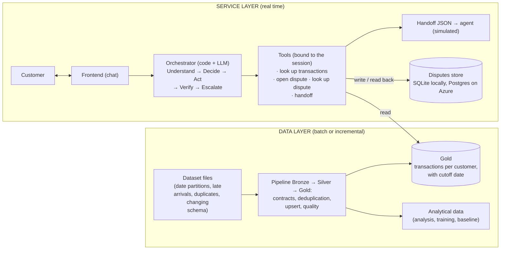
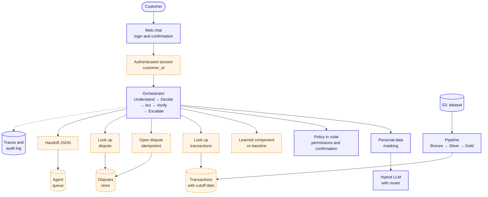
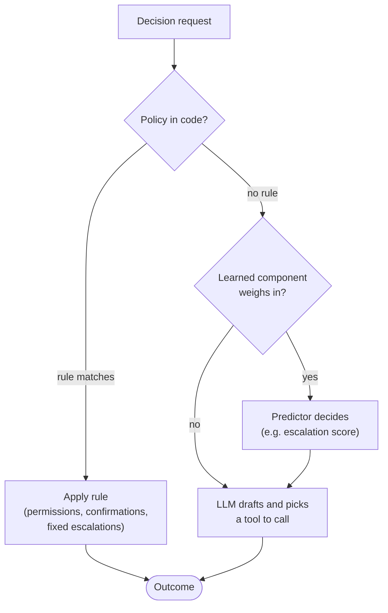
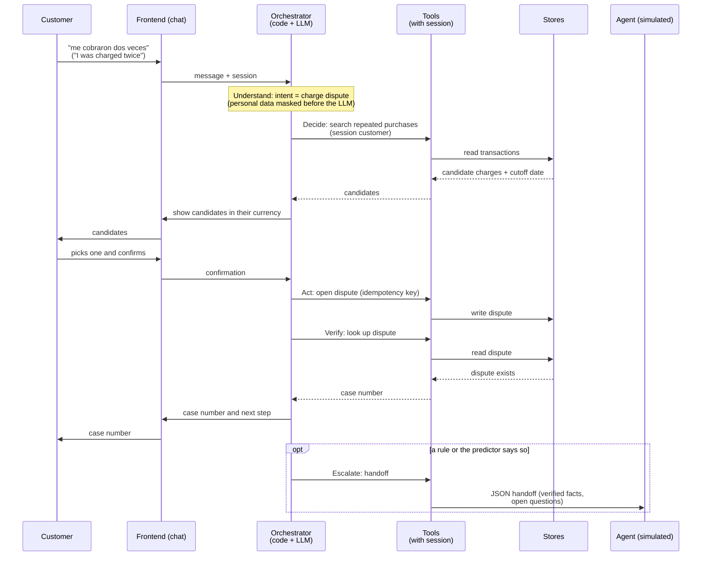

# Architecture

How Sentinel Engine is put together for the transaction-disputes flow ([decision 003](../build/decisions/003-disputes-flow.md)). It runs on Azure; the parts of the stack that are still open are listed under [stack](#stack).

**Purpose:** see how the pieces fit before reading the areas. **Related:** [conversation](../build/conversation.md), [security](../build/security.md), [areas](../build/areas/), [glossary](glossary/), [architecture and roadmap](../build/architecture-roadmap.md).

## Central principle

**AI understands; code executes and verifies.** The LLM interprets the customer and drafts replies. Permissions, confirmations, actions and their verification live in code. This document is the source of that principle and of the layers below; [conversation](../build/conversation.md) turns it into rules for what the assistant says, and other documents link here rather than repeat it.

## Two layers

- **Service layer:** what matters is latency, verified actions, bounded retries and idempotency.
- **Data layer:** what matters is quality, freshness and reproducibility. Every read returns the data **and how current it is**.
- **Two stores, two jobs.** Tools read transactions from Gold, which the pipeline fills in batches. Disputes are written to a small operational store, so the assistant can open one and read it back at once to verify it.

## Components and mocks

We start with mocks that have fixed contracts and replace them one at a time without changing the contract (see the [plan](../../team/plan.md#mocks)). Dashed orange: mock to implement. Blue: real component.

- **Session:** a trusted test session. Every tool filters by its `customer_id`, never by an identifier typed in the chat.
- **Learned component:** starts as a fixed rule; when the model arrives, the rule stays as its baseline.
- **Disputes store:** SQLite locally and Postgres on Azure, separate from Gold. Opening a dispute is idempotent from the first version, so a retry never creates a duplicate.

## Decision priority

When several parts could decide, the higher one wins:

1. **Policy in code.** Permissions, confirmations and fixed rules. Example: if the customer asks for a person, we escalate.
2. **Learned component**, when it takes part (e.g. an escalation predictor). It decides whether to escalate where no rule applies.
3. **LLM.** Understands the customer, drafts the reply and picks which tool to call. It never picks which customer to read.

## LLM visibility

- It sees the customer's text and the tool **results**.
- It **never** sees identifiers, documents, income, credit score or IP. The orchestrator knows the customer from the session.
- Details in [security](../build/security.md) and [decision 004](../build/decisions/004-pii-lifecycle.md).

## Walkthrough of a case (example: duplicate-charge dispute)

1. The customer writes "me cobraron dos veces" ("I was charged twice").
2. **Understand:** the intent is a charge dispute.
3. **Decide:** details are missing, so a tool searches the session customer's repeated purchases.
4. The assistant shows the candidates in their original currency, with the data cutoff date. The customer picks one.
5. **Act:** after the customer confirms, a tool opens the dispute with an idempotency key.
6. **Verify:** a second tool reads the dispute back. Only when it exists does the customer get the case number.
7. **Escalate** when a rule or the predictor calls for it: a JSON handoff with verified facts and open questions.

## Learned component

Chosen at the Tuesday 9/29 review, together with the flow; the candidates are in [decision 003](../build/decisions/003-disputes-flow.md). Whatever we pick is measured against a baseline. Details in [ML](../build/areas/ml.md).

## Stack

| Piece | Status |
|---|---|
| Platform | **Azure** ([decision 001](../build/decisions/001-azure-platform.md)) |
| Specifications | **OpenSpec** ([decision 002](../build/decisions/002-openspec.md)) |
| LLM | **Hybrid, with a router** between models. Which model serves each route: Tue 9/29 (decision 10) |
| Disputes store | **SQLite locally, Postgres on Azure**, separate from Gold |
| Data storage | Tue 9/29 (decision 12): local DuckDB or Databricks, both with Bronze/Silver/Gold. Meanwhile the pipeline starts locally |
| Backend | Open (decision 9); proposal: Python with FastAPI |
| Frontend | Open (decision 11): Streamlit, Gradio or our own web app (Python or Node) |
| Deployment | Open (decision 13); proposal: Azure Container Apps or App Service |
| Repositories | Open (decision 21): one repository or one per domain (Natalia's proposal). The submission requires a single public repository |

**Target:** the system runs on Azure and, locally, on Linux. .NET is out because it is not part of the team's stack (Python, FastAPI).

> [!WARNING]
> Windows is not a target, but a teammate may develop on it. Known friction: the commit hook is a bash script (it needs Git Bash), and local PySpark/Delta Lake needs Java and usually `winutils`. Work that runs remotely (Databricks, Azure) avoids both.

Each choice is recorded in [decisions](../build/decisions/).
