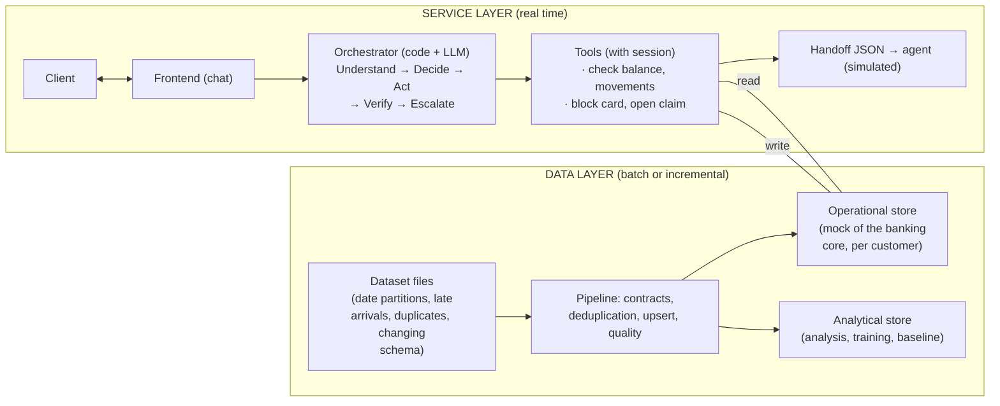
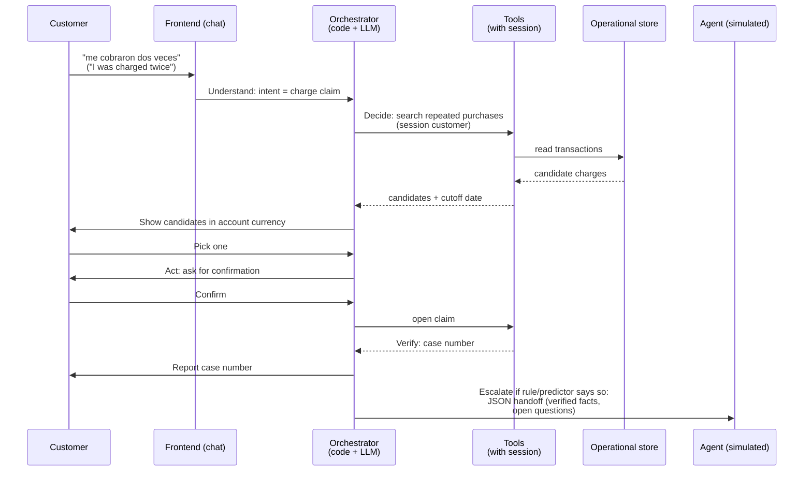

# Architecture

System overview. Platform: Azure; we decide the rest of the stack after choosing the flow.

**Purpose:** understand how the pieces fit together before reading the areas. **Related:** [conversation](../build/conversation.md), [security](../build/security.md), [areas](../build/areas/), [glossary](glossary/).

## Central principle

**AI understands; code executes and verifies.** This document is the source of this principle and of the layers; the conversation rules that follow from it live in [conversation](../build/conversation.md). Other documents link here instead of repeating it.

## Two layers

- **Service layer:** latency, action verification, retries, and idempotency matter.
- **Data layer:** quality, freshness, and reproducibility matter. Every read returns the data **and how current it is**.

## Decision priority

Highest to lowest:

1. **Policy in code.** Permissions, confirmations, and fixed rules (for example: if the customer asks to speak to a person, we escalate).
2. **Learned component**, if it takes part in the decision (e.g., an escalation predictor). It decides whether escalation is worthwhile where there is no rule.
3. **LLM.** Understands the customer, drafts responses, and chooses which tool to call; it never chooses which customer to read from.

## LLM visibility

- The customer text and tool **results**.
- **Never:** identifiers, documents, income, credit score, or IP. The orchestrator knows who the customer is from the session.
- Detail in [security](../build/security.md).

## Walkthrough of a case (example: duplicate-charge claim)

1. The customer writes: "me cobraron dos veces" ("I was charged twice").
2. **Understand:** intent = charge claim.
3. **Decide:** data is missing, so the tool searches the session customer's repeated purchases.
4. The assistant shows the candidate charges in their currency and with the data cutoff date. The customer picks one.
5. **Act:** it asks for confirmation and the tool opens the claim.
6. **Verify:** the tool confirms the case number; only then do we give it to the customer.
7. **Escalate** if the predictor or a rule indicates it: JSON handoff with verified facts and open questions.

## Learned component

We decide it together with the flow; with the transaction-disputes flow, the candidates are in [decision 003](../build/decisions/003-disputes-flow.md). Whichever it is, we compare it against a baseline. Detail in [ML](../build/areas/ml.md).

## Stack

| Piece | Choice |
|---|---|
| Platform | **Azure** ([decision 001](../build/decisions/001-azure-platform.md)) |
| Specifications | **OpenSpec** ([decision 002](../build/decisions/002-openspec.md)) |
| LLM | To be decided; proposal: Azure OpenAI |
| Deployment | To be decided; proposal: Azure Container Apps or App Service |
| Language, framework, storage | To be decided. The initial proposal in [flow options](../build/flows/options.md) (DuckDB, FastAPI, multilingual embeddings, Azure OpenAI) remains valid within Azure |

We record each choice in [decisions](../build/decisions/).
