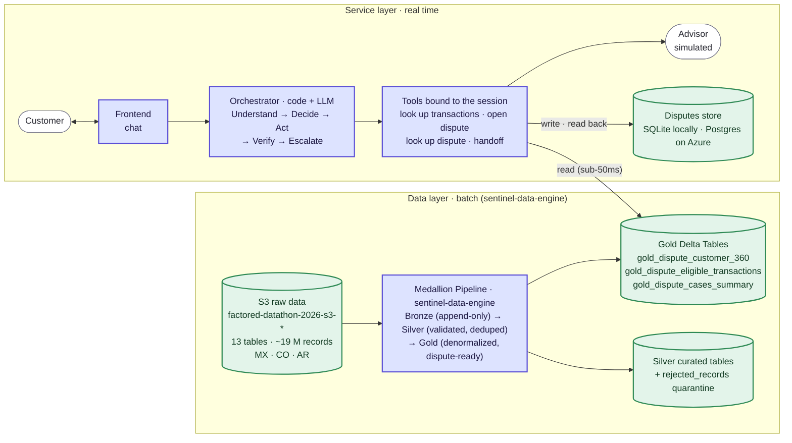
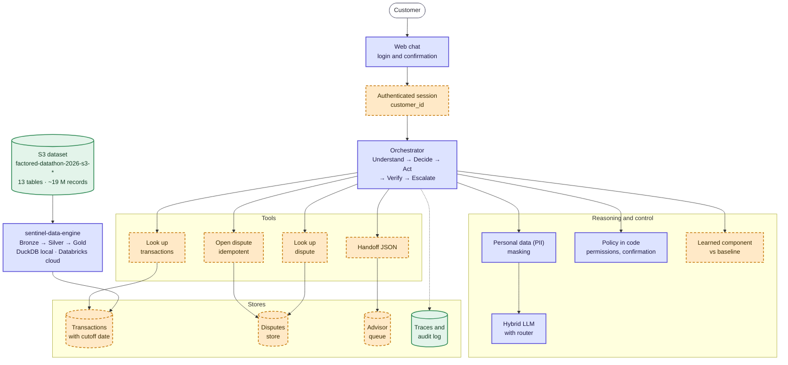
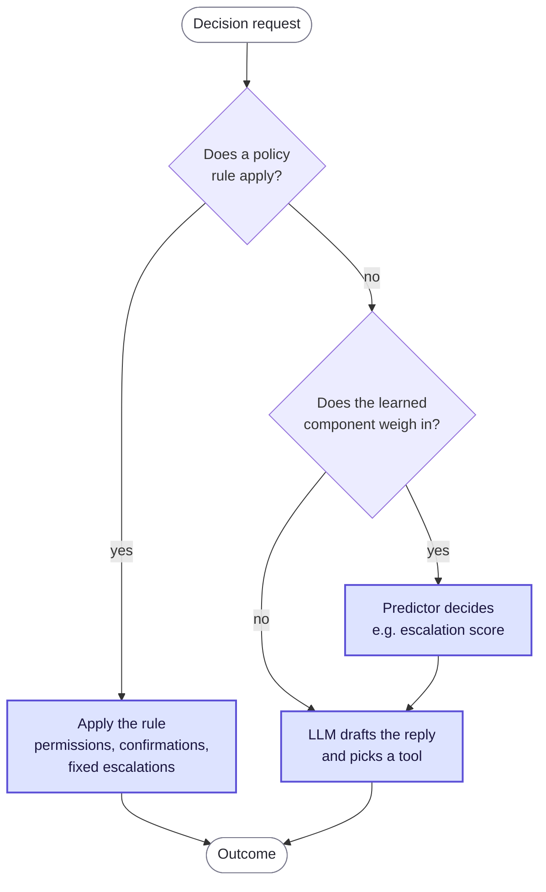
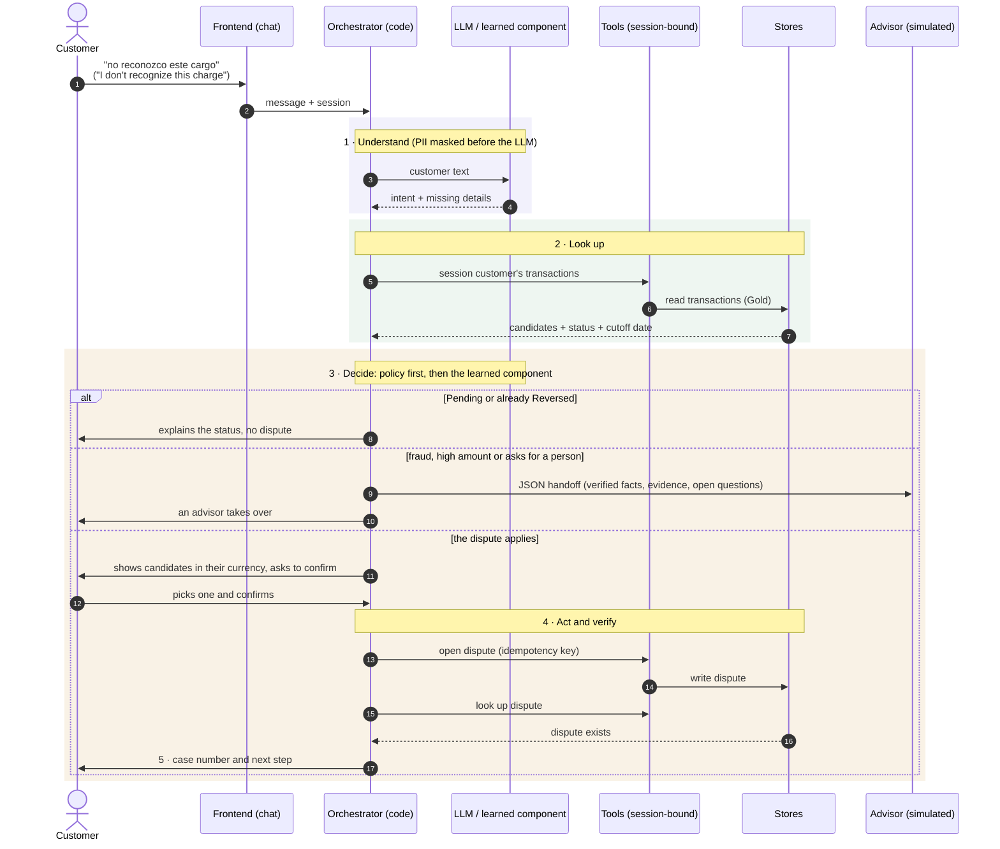

# Architecture

How Sentinel Engine is put together for the transaction-disputes flow ([decision 003](../build/decisions/003-disputes-flow.md)). It runs on Azure; the parts of the stack that are still open are listed under [stack](#stack).

**Purpose:** see how the pieces fit before reading the areas. **Related:** [conversation](../build/conversation.md), [security](../build/security.md), [areas](../build/areas/), [glossary](glossary/), [architecture and roadmap](../build/architecture-roadmap.md).

## Central principle

**AI understands; code executes and verifies.** The LLM interprets the customer and drafts replies. Permissions, confirmations, actions and their verification live in code. This document is the source of that principle and of the layers below; [conversation](../build/conversation.md) turns it into rules for what the assistant says, and other documents link here rather than repeat it.

## Two layers

- **Service layer:** what matters is latency, verified actions, bounded retries and idempotency.
- **Data layer:** what matters is quality, freshness and reproducibility. Every read returns the data **and how current it is**.
- **Two stores, two jobs.** Tools read transactions from Gold, which the pipeline fills in batches. Disputes are written to a small operational store, so the assistant can open one and read it back at once to verify it.

## Components and mocks

We start with mocks that have fixed contracts and replace them one at a time without changing the contract (see the [plan](../../team/plan.md#mocks)). Dashed orange: mock to implement. Blue: real component. Green: store that is real from the start.

- **Session:** a trusted test session. Every tool filters by its `customer_id`, never by an identifier typed in the chat.
- **Learned component:** starts as a fixed rule; when the model arrives, the rule stays as its baseline.
- **Disputes store:** SQLite locally and Postgres on Azure, separate from Gold. Opening a dispute is idempotent from the first version, so a retry never creates a duplicate.

## Decision priority

When several parts could decide, the higher one wins:

1. **Policy in code.** Permissions, confirmations and fixed rules. Example: if the customer asks for a person, we escalate.
2. **Learned component**, when it takes part (proposed: a prompted LLM that flags when to escalate). It decides whether to escalate where no rule applies.
3. **LLM.** Understands the customer, drafts the reply and picks which tool to call. It never picks which customer to read.

## LLM visibility

- It sees the customer's text and the tool **results**.
- It **never** sees identifiers, documents, income, credit score or IP. The orchestrator knows the customer from the session.
- Details in [security](../build/security.md) and [decision 004](../build/decisions/004-pii-lifecycle.md).

## Walkthrough of a case (example: unrecognized charge)

The suggested flow starts as an account inquiry and becomes a dispute only when it has to ([flow selection analysis](../build/flows/03-flow-selection.md#suggested-flow)).

1. **Understand:** the LLM reads the masked text and returns the intent and what is missing.
2. **Look up:** a session-bound tool returns the customer's candidate charges, their status and the data cutoff date.
3. **Decide:** policy rules first, then the learned component. A Pending charge may clear on its own and a Reversed one is already refunded, so neither opens a dispute. Fraud, a high amount or a request for a person escalate with a JSON handoff.
4. **Act and verify:** after the customer confirms, the dispute is opened with an idempotency key and read back.
5. **Respond:** the customer gets the case number only when the dispute exists.

## Learned component

Proposed for the Tuesday 9/29 review: a **prompted LLM** that classifies intent and flags when to escalate, measured against a keyword baseline on the same held-out cases (REQ-0016; the mentors confirmed on 9/28 that a prompted LLM counts). The dataset has no learnable tabular label and no real customer language, so evaluation uses team-generated es-419 and pt-BR text, declared as such ([flow data evidence](../build/flows/03-flow-selection.md)). Details in [ML](../build/areas/ml.md).

## Path to production

REQ-0052. Cloud deployment is not mandatory (mentors, 9/28); what counts is a credible path to production. The prototype keeps a minimal deployment for the public link and documents the rest.

| Aspect | Prototype | Production |
|---|---|---|
| Data | DuckDB + Delta Lake (local `./data/`) — sentinel-data-engine, full Medallion pipeline implemented | Azure Databricks + PySpark + Delta Lake on ADLS Gen2 (Databricks Asset Bundle in `databricks.yml`) |
| Disputes store | SQLite | Postgres on Azure |
| Serving | One container behind the public link | Azure Container Apps with autoscaling |
| LLM | Hybrid router, usage caps | Same router, per-route quotas and fallback |
| Monitoring | Traces and audit log in files | Centralized logs, alerts by country |
| Security | Test session, masked PII, secrets in `.env` | Identity provider, Key Vault, retention policy |
| Volume | Sized to the sample (see [analysis](../build/areas/analysis.md#sizing)) | Capacity plan from real traffic |

## Stack

| Piece | Status |
|---|---|
| Platform | **Azure** ([decision 001](../build/decisions/001-azure-platform.md)) |
| Specifications | **OpenSpec** ([decision 002](../build/decisions/002-openspec.md)) |
| LLM | **Hybrid, with a router** between models. Which model serves each route: Tue 9/29 (decision 10) |
| Disputes store | **SQLite locally, Postgres on Azure**, separate from Gold |
| Data storage | **Delta Lakehouse** — DuckDB locally (zero cost, no server), Azure Databricks in production. Both run the same `sentinel_data` package via `--run-mode local\|databricks`. Medallion pipeline (Bronze → Silver → Gold) fully implemented in `sentinel-data-engine/`. |
| Backend | **Python + FastAPI** (decided). Loop tool deferred: LangGraph or plain Python ([decision 005](../build/decisions/005-backend.md)) |
| Frontend | **One-page chat served by FastAPI.** No Streamlit or Gradio ([decision 006](../build/decisions/006-frontend.md)) |
| Deployment | Open (decision 13); proposal: Azure Container Apps or App Service |
| Repositories | **One public repository** (decision 21). Git submodules still open |

**Target:** the system runs on Azure and, locally, on Linux. .NET is out because it is not part of the team's stack (Python, FastAPI).

> [!WARNING]
> Windows is not a target, but a teammate may develop on it. Known friction: the commit hook is a bash script (it needs Git Bash), and local PySpark/Delta Lake needs Java and usually `winutils`. Work that runs remotely (Databricks, Azure) avoids both.

Each choice is recorded in [decisions](../build/decisions/).
