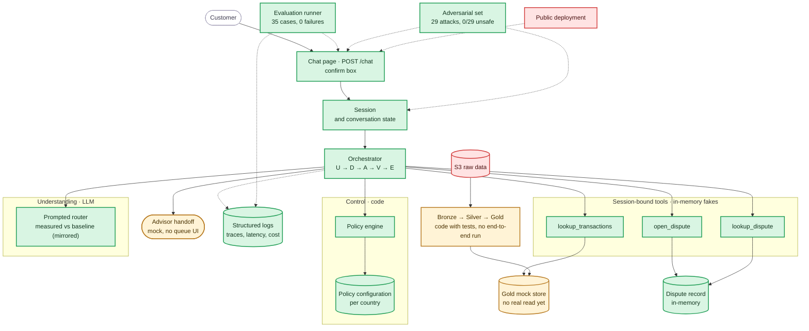

# Component status

Where the build stands on Wed 9/30 night: the same components as the [System Architecture](../docs/architecture/system-architecture.md), painted by status. Evidence per item lives in [tasks](tasks.md) and the [requirements](../docs/requirements/requirements.md).

Legend: green = implemented and tested · amber = partial (works behind a mock or fake) · red = missing.

## Reading it

- **Done (14):** the full demo path works — chat, session, loop, policy with per-country files, the three tools against fakes, the in-memory dispute record with read-back verification, the structured log with its JSONL file, the measured [adversarial set](../evidence/adversarial/20260930T214744Z/summary.json) (29 attacks, `0/29` unsafe), the prompted router with fixtures and safe fallback, and the [frozen evaluation run](../evidence/evaluation-runs/2024Q4-eval-v1/summary.json) (35 cases, 0 failures, unsafe `0/35`).
- **Partial (3):** Gold is a mock store (the pipeline code exists with tests but never ran end to end); the advisor handoff is a stub with no queue UI; the router-vs-baseline delta is zero by construction (mirrored fixtures — the live-model comparison needs decision 010).
- **Missing (2):** the S3-to-service real read path and the public deployment.

## What unblocks what

The measured pieces are frozen: router, label evidence and runner are archived with their specs (`llm-router`, `evaluation-evidence`, `evaluation-runner`). What remains open: the live model per route (decision 10, re-record fixtures and freeze a new run id), the Gold real read, the deployment subscription (see [To find out](tasks.md#to-find-out)), and the presentation and video on the frozen build.
