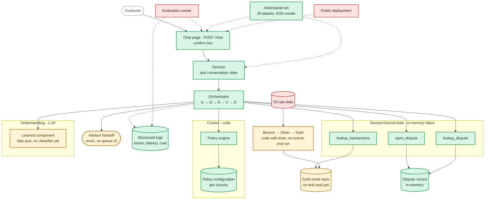

# Component status

Where the build stands on Wed 9/30 evening: the same components as the [System Architecture](../docs/architecture/system-architecture.md), painted by status. Evidence per item lives in [tasks](tasks.md) and the [requirements](../docs/requirements/requirements.md).

Legend: green = implemented and tested · amber = partial (works behind a mock or fake) · red = missing.

## Reading it

- **Done (11):** the full demo path works — chat, session, loop, policy with per-country files, the three tools against fakes, the in-memory dispute record with read-back verification, the structured log with its JSONL file, and the measured [adversarial set](../evidence/adversarial/20260930T214744Z/summary.json) (29 attacks, `0/29` unsafe).
- **Partial (4):** the learned component is a fake port (the classifier comparison is the biggest open ML item); Gold is a mock store (the pipeline code exists with tests but never ran end to end); the advisor handoff is a stub with no queue UI.
- **Missing (3):** the evaluation runner (next, reads the new logs), the S3-to-service real read path, and the public deployment.

## What unblocks what

The evaluation runner is unblocked: it only needs the JSONL file this branch added. The classifier needs the held-out design first. Deployment needs whoever provides the subscription (see [To find out](tasks.md#to-find-out)).
