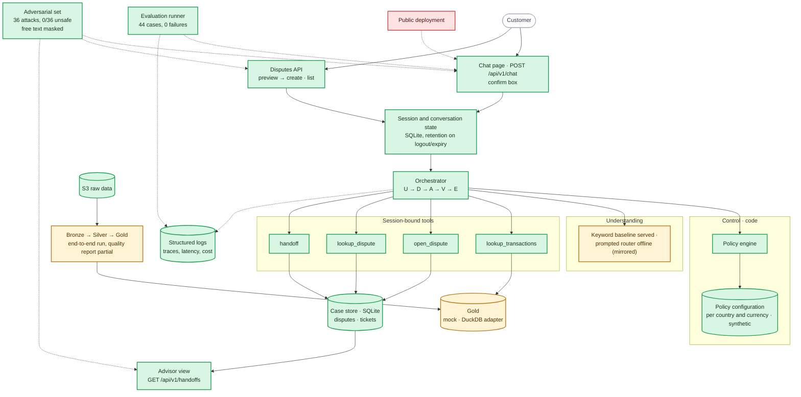

# Component status

Where the build stands on Thu 10/1: the same components as the [System Architecture](../docs/architecture/system-architecture.md), painted by status. Evidence per item lives in [tasks](tasks.md) and the [requirements](../docs/requirements/requirements.md).

Legend: green = implemented and tested · amber = partial (works behind a mock, offline only, or not run on real data) · red = missing.

## Reading it

- **Done (16):** policy configuration with synthetic fraud and high-amount thresholds per account country and currency ([010](../docs/build/decisions/010-fraud-handoff-rule.md), [011](../docs/build/decisions/011-high-amount-threshold.md)); the full demo path on one app and one API under `/api/v1`: chat and the two-step disputes API on the same turn cycle, password session with roles, conversation state in SQLite that survives a restart and is deleted on logout or expiry, the loop and policy engine, the four tools with one open dispute per charge and read-back verification, handoff tickets with a conversation summary and every attempted action, the read-only advisor view, the structured log, free-text personal-data masking before the model, the [latest evaluation run](../evidence/evaluation-runs/2024Q4-eval-v6/summary.json) (44 cases, 0 failures) and the [latest adversarial run](../evidence/adversarial/20261001T222341Z/summary.json) (36 attacks, `0/36` unsafe, A9 blocked); the S3 raw data synced locally.
- **Partial (3):** understanding (the demo serves the keyword baseline; the prompted router is measured offline against mirrored fixtures, so the delta is zero by construction until decision 10); Gold (the pipeline writes the view into `data/gold_bank.duckdb`, but the adapter reads a Delta table under `data/gold/`, so the app still falls back to the mock); the pipeline (run end to end with incremental tests, sources inventoried and sizing written, but the quality report lacks nulls, orphans and late arrivals).
- **Missing (1):** the public deployment.

## What unblocks what

The measured pieces are frozen: router, label evidence and runner are archived with their specs (`llm-router`, `evaluation-evidence`, `evaluation-runner`); the integration, persistence and advisor work merged with PR #23 on 10/1; its three OpenSpec changes and `add-fraud-and-high-amount-rules` are archived under `openspec/changes/archive/` (2026-10-01), with the main specs synced. What remains open: the live model per route and serving it (decision 10, re-record fixtures and freeze a new run id), the Gold real read in the app (DuckDB file versus Delta view), how the system serves Portuguese without Portuguese data (decision 15, REQ-0012), the deployment subscription (see [To find out](tasks.md#to-find-out)), and the presentation and video on the frozen build.
