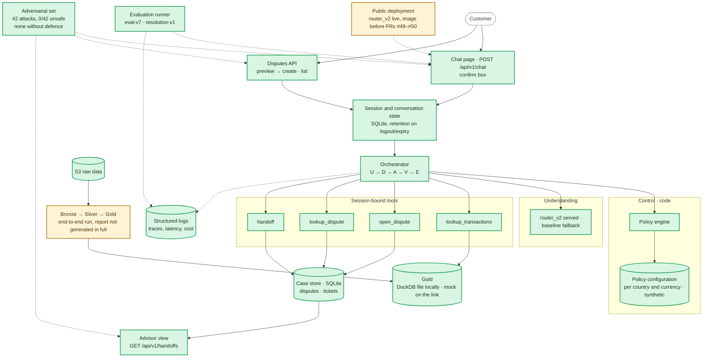

# Component status

Where the build stands on Fri 10/2, after PR #50: the same components as the [System Architecture](../docs/architecture/system-architecture.md), painted by status. Evidence per item lives in [tasks](tasks.md) and the [requirements](../docs/requirements/requirements.md).

Legend: green = implemented and tested · amber = partial (works behind a mock, offline only, or not run on real data) · red = missing.

## Reading it

- **Done (18):** the full demo path on one app and one API under `/api/v1`: chat and the two-step disputes API, password session with roles, conversation state in SQLite deleted on logout or expiry, the loop and the policy engine with synthetic fraud and high-amount thresholds per account country and currency ([010](../docs/build/decisions/010-fraud-handoff-rule.md), [011](../docs/build/decisions/011-high-amount-threshold.md)), the four tools with read-back verification, handoff tickets and the read-only advisor view, the structured log, free-text masking; understanding (router_v2 served with a baseline fallback, measured in `2024Q4-eval-v7`; narrowing by what the customer said, the "why?" answer, the prompt-extraction refusal and the injection record in code, PRs #42 and #49); Gold (the app reads the PII-free view from the DuckDB file locally, PR #50); the evaluation (`2024Q4-eval-v7`, `2024Q4-resolution-v1`) and the [latest adversarial run](../evidence/adversarial/20261002T222323Z/summary.json) (42 attacks, `0/42` unsafe, none left without defence).
- **Partial (2):** the pipeline (end to end with incremental tests and Silver columns restored in PR #44, but the quality report's drop, orphan, late-arrival and null sections are written by hand and the next run overwrites them: `quality-report`); the public deployment (router_v2 is live, but the image predates PRs #49 and #50 and state is on the ephemeral disk: redeploy and `runtime-and-ci`).
- **Missing (0).** Small talk is still classified out of scope (`router-v3`); system outcomes per language and country and app monitoring are `evaluation-final`.

## What unblocks what

Merged and archived: `dispute-answers`, `resolution-eval`, `chat-loop`, `real-gold`. Open changes, each on its own branch: `runtime-and-ci` (in progress), `quality-report` (Natalia), `ui-product`, `evaluation-final` (unblocked by `chat-loop`), then `router-v3`.
