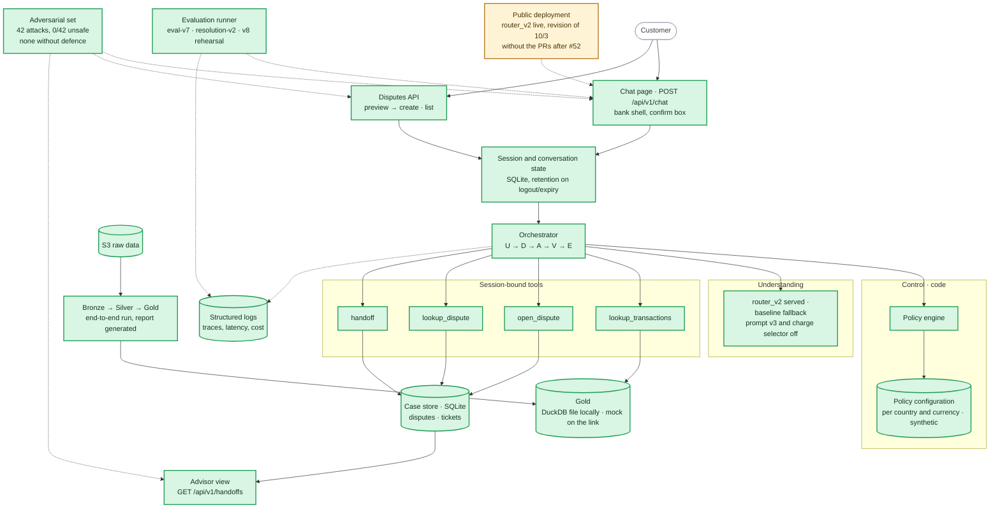

# Component status

Where the build stands on Mon 10/5, after PR #67: the same components as the [System Architecture](../docs/architecture/system-architecture.md), painted by status. Evidence per item lives in [tasks](tasks.md) and the [requirements](../docs/requirements/requirements.md).

Legend: green = implemented and tested · amber = partial (works behind a mock, offline only, or not run on real data) · red = missing.

## Reading it

- **Done (19):** the full demo path on one app and one API under `/api/v1`.
  - Chat and the two-step disputes API, password session with roles, and conversation state in SQLite deleted on logout or expiry.
  - The loop and the policy engine with synthetic fraud and high-amount thresholds per account country and currency ([010](../docs/build/decisions/010-fraud-handoff-rule.md), [011](../docs/build/decisions/011-high-amount-threshold.md)).
  - The four tools with read-back verification, handoff tickets and the read-only advisor view, the structured log and free-text masking.
  - The bank interface: bank shell, charge states, the "Mis reclamos" panel, the phone layout and the white label (`bank-ui`).
  - Understanding: `router_v2` served with a baseline fallback, measured in `2024Q4-eval-v7`. The chat answers greetings, thanks and "are you a bot?", and the model writes a draft only on turns that do not decide ([024](../docs/build/decisions/024-model-wording.md), `chat-start`). Code narrows the charge list, answers the "why?" and refuses prompt extraction.
  - Gold: the app reads the PII-free view from the DuckDB file locally.
  - The pipeline: the quality report is generated by the runner (`quality-report`).
  - The evaluation: `2024Q4-eval-v7`, `2024Q4-resolution-v2`, the calibration runs, the trained baseline (`train-v1`) and the v8 rehearsal and ablation. See the [evidence index](../evidence/README.md).
  - The [latest adversarial run](../evidence/adversarial/20261005T014816Z/summary.json): 42 attacks, `0/42` unsafe, none left without defence.
  - Robustness code from `robustness-evidence`: the health route, the audit chain, the spend cap and the fault injection. The runs that measure it wait for the code freeze. None is in `evidence/` yet.
- **Partial (1):** the public deployment. `router_v2` is live and the state is on an Azure Files share, but the revision is from 10/3 (commit `9664d9d`, PR #52) and does not include the pull requests after it. The final redeploy comes before the video.
- **Off on purpose:** prompt v3 (`SENTINEL_LLM_PROMPT_VERSION=v3`) stays off until the v8 measurement approves it. The confidence cut-offs (`SENTINEL_LLM_CUTOFFS`) and the charge selector (`SENTINEL_CHARGE_RANKER`, [025](../docs/build/decisions/025-charge-selector.md)) are also off by default.
- **Missing (0).**

## What unblocks what

Merged and archived: `dispute-answers`, `resolution-eval`, `chat-loop`, `real-gold`, `runtime-and-ci`, `quality-report`, `ui-product`, `evaluation-final`, `flow-fixes`, `router-v3`, `bank-ui`, `chat-start`, `problem-evidence`, `trained-baseline`, `charge-ranker` and `robustness-evidence`. Open changes: `eval-v8` and `docs-followups`.

After the code freeze, three things remain: the single v8 measurement with its verdict, the robustness runs and the final redeploy. Their plan is not in this repository.
