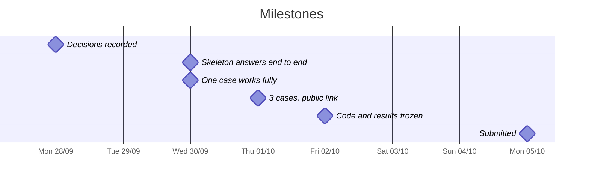

# Team plan

Sentinel Engine · Factored AI & Data Hackathon 2026 · Submission: **Monday 10/5, 11:59 pm (UTC-5)**

> We start on Monday 9/28. Day tasks live in [tasks](tasks.md) and open choices in [pending decisions](pending-decisions.md).

## Schedule

Tentative: we adjust it if anything slips.

| Day | Date | Goal | Milestone |
|---|---|---|---|
| Sun | 9/27 | Prepare: data access, repository, readings | Everyone has access |
| Mon | 9/28 | **Decide** flow, stack, owners and working method. First look at the data | Decisions recorded |
| Tue | 9/29 | Skeleton: 4 mock tools, orchestrator, simple chat, minimal pipeline. Analysis backing the flow | **The skeleton answers end to end** · *not reached: moved to Wed 9/30* |
| Wed | 9/30 | Skeleton (moved from Tue). Normal case with real data, JSON handoff, learned component vs baseline | **The skeleton answers end to end; one case works fully** |
| Thu | 10/1 | Ambiguous and human cases, Portuguese, adversarial set, deployment. Video script and slide outline start. P1 if time allows | **3 cases in es-419 and pt-BR, public link** |
| Fri | 10/2 | Held-out evaluation and metrics. README in English, limitations; review the repo for secrets. Group validates the slide outline. Freeze code at night | **Code and results frozen** |
| Sat to Mon | 10/3 to 10/5 | Presentation review and video recording on the frozen build (results from Fri). Critical fixes only. Submit with margin on Mon | **Submitted** |

Per-person work is in [tasks](tasks.md), not on this chart. We want **code, results and README frozen by Friday 10/2**. The presentation and the video are finished over the weekend and Monday 10/5, on top of the frozen build, so the extra days go to building more. Set an internal submission time on Monday, well before 11:59 pm. Working first: if anything optional blocks a mandatory item, it waits. Priorities live in the [requirements](../docs/requirements/requirements.md).

## Decisions made

| Decision | Status | Record |
|---|---|---|
| Team name: Sentinel Engine | Accepted | — |
| Platform: Microsoft Azure | Accepted | [001](../docs/build/decisions/001-azure-platform.md) |
| Specs with OpenSpec, written in English (decision 18) | Accepted | [002](../docs/build/decisions/002-openspec.md) |
| Owners: Natalia, data and data analysis · Rubén, AI, architecture and ML · Felix, full-stack | Accepted | — |
| Hybrid LLM with a router across models (models chosen on Tuesday) | Accepted | — |
| Infrastructure budget: Natalia's estimate (USD 20-58, within the USD 200 Azure trial credit) as the working assumption | Accepted | [cost](../docs/build/cost.md) |
| Dispute record: in-memory for the submission; SQLite locally and Postgres on Azure only as the production backend of the same tool contract. Not written to Gold | Accepted | [demo](../docs/architecture/demo-architecture.md), [path to production](../docs/architecture/specification.md#path-to-production) |
| No .NET: outside the team's stack (Python, FastAPI). Target is Azure; locally it runs on Linux | Accepted | [stack](../docs/architecture/system-architecture.md#stack-and-deployment) |
| Flow: transaction disputes, entered through an account inquiry (confirmed 9/29) | Accepted | [003](../docs/build/decisions/003-disputes-flow.md) |
| Repository language: everything in English, including `docs/` and `team/` (decision 19, closed 9/28) | Accepted | [pending decisions](pending-decisions.md) |
| No daily sync meeting. Slack if we talk every day; a status, if needed, at the end of the day (decision 5) | Accepted | [pending decisions](pending-decisions.md) |
| Backend: Python + FastAPI (decision 9); loop tool (LangGraph or plain Python) deferred | Accepted | [005](../docs/build/decisions/005-backend.md) |
| Frontend: one-page chat served by FastAPI; no Streamlit or Gradio (decision 11) | Accepted | [006](../docs/build/decisions/006-frontend.md) |
| Learned component: prompted LLM classifying the dispute category, against a keyword baseline, on team-written text | Accepted | [007](../docs/build/decisions/007-learned-component.md) |
| Video and slides: Rubén. Script from Thursday 10/1. Slide outline Thursday 10/1, validated by the group Friday 10/2, reviewed from Friday to Monday with the results; frozen Monday 10/5 (decision 20) | Accepted | [delivery](../docs/build/delivery.md) |
| Tasks live in the repo; follow-up is in the team channel. Rubén reviews what is still pending (decision 6) | Accepted | [tasks](tasks.md) |
| Code: branch, push, Slack authorization, author merges. No direct push to `main` (decision 7) | Accepted | [pending decisions](pending-decisions.md) |
| No standing milestone meetings. Ad hoc only (decision 8) | Accepted | [pending decisions](pending-decisions.md) |
| One public repository (decision 21), organised by folders; no git submodules (decision 22). Service folder: `sentinel-ai-core/` | Accepted | [Folders](#folders) |

Product and technical decisions go in [decisions](../docs/build/decisions/), one file per decision. Team decisions (working method, owners) are recorded here.

## Working method

| Topic | How we work |
|---|---|
| Communication | Everything in the team channel. Challenge questions go to the hackathon help channel |
| Status | No standing sync and no standing milestone meetings. We talk on Slack during the day. A meeting, individual or with the group, happens only when a task needs it; the outcome goes in the channel |
| Tasks | In [tasks](tasks.md), with owner, date and status |
| Specs | With OpenSpec: we propose each change before implementing and cite its requirements |
| Code | Branch per change, push, ask in Slack for authorization to merge. Any other teammate can authorize; the author merges. No direct push to `main` |
| Decisions | Product and technical ones in [decisions](../docs/build/decisions/); team ones here. We announce all of them in the channel |
| Progress | When a task closes, we update its status in the [requirements](../docs/requirements/requirements.md) |
| Repository | Single repo (`factored-hackathon-2026-sentinel-engine`), public from the start and it stays public |

Two hackathon rules are non-negotiable: no secrets or data in the repo (credentials go in `.env` and are shared by direct message), and the submission is in English.

## Folders

Two code folders. `sentinel-ai-core/` is the whole FastAPI process, including the chat, its policy configuration and the evaluation runner. It is not a separate AI service. No web package and no infrastructure folder.

| Path | Who | What | Status |
|---|---|---|---|
| `sentinel-data-engine/` | Natalia | Medallion pipeline. Gold table and columns of the [data contract](../docs/architecture/specification.md#data-contract), as-of date, labelled incremental fixture. | Partial: pipeline, quarantine and `gold_dispute_eligible_transactions` in Gold with the contract columns exist; incremental fixture and as-of read not confirmed |
| `sentinel-ai-core/app/static/`, `routers/` | Felix | Chat page with the confirm box, `POST /chat` with the structured confirmation field ([confirmation](../docs/architecture/specification.md#confirmation)). | Not started |
| `sentinel-ai-core/app/session/` | Felix | Test session and [conversation state](../docs/architecture/specification.md#conversation-state), deleted on expiry. | Not started |
| `sentinel-ai-core/app/orchestrator/`, `policy/`, `ai/` | Rubén | Loop, policy engine (evaluates the rules and the decision priority), `confirmation_token`, router, learned component. | Not started |
| `sentinel-ai-core/config/policy/` | Rubén | Policy parameters, not code: synthetic [policy source](../docs/architecture/specification.md#policy-source), one file per country (MX, CO, AR), thresholds of decisions 25–27. Read by the engine in `app/policy/`. | Not started |
| `sentinel-ai-core/app/tools/` | Felix and Rubén | The four tool contracts. Natalia owns what Gold returns. | Not started |
| `sentinel-ai-core/app/observability/` | Felix | Structured log records with `trace_id`, latency, tokens and cost ([observability](../docs/architecture/specification.md#observability)). Rubén defines the model and prompt fields. | Not started |
| `sentinel-ai-core/eval/` | Rubén | [Evaluation](../docs/architecture/specification.md#evaluation) cases (JSONL) and runner, system vs baseline, with fault injection. | Not started |
| `evidence/` (evaluation runs) | Natalia | Metrics by language and country from the runner's output, frozen per run; cost per resolution (REQ-0055, REQ-0057). | Not started (flow measurements exist) |
| Infrastructure as code | Nobody yet | Do not create the folder unless decision 13 lands. | Not started |

Evaluation lives inside `sentinel-ai-core/` because it drives `POST /chat`; it is not a third code folder. Its results follow the write-once rule of `evidence/`.

## Mocks

We start with well-documented mocks and swap them for the real thing one by one, without touching their contracts. Shown here for the transaction-disputes flow.

- **Wed 9/30, skeleton (planned for Tue 9/29; no mock was ready that day):** a test session and 4 in-memory mock tools with the contracts in [system](../docs/architecture/specification.md#tool-contracts): look up transactions, open dispute (idempotent from the start, so a retry never duplicates it), look up dispute to verify, and the handoff. Simple chat and Understand → Decide → Act → Verify → Escalate orchestrator. Policy lives in code and the JSON handoff exists from the skeleton: the LLM understands, drafts and picks which tool to call, but never decides permissions or confirms actions.
- **When we swap each mock:** when the milestone asks for it, without changing the contract.

| Milestone | Stays a mock | Becomes real | Not in this submission |
|---|---|---|---|
| Tue 9/29 | Nothing was ready; the skeleton moves to Wed | — | — |
| Wed 9/30 | Four tools in memory, test session, synthetic policy configuration, simulated advisor, `.env` | Chat and `POST /chat`, orchestrator loop, policy engine, JSON handoff | Identity provider, Key Vault |
| Thu 10/1 | Dispute record (in memory) | Charge lookup on Gold if the read path is up, otherwise the fixture stays and we say so. Structured confirmation, bounded retries, structured logs | Dispute-record engine (not decided) |
| Fri 10/2 | Anything not reached, reported as a limitation | Evaluation runner and results. Incremental pipeline, if it lands | Advisor delivery channel (decision 28) |

The dispute-record engine is not a milestone: it stays in memory for the submission.
- **Rule:** every mock documents its contract and limitations, as the brief asks (Data and execution boundaries): REQ-0004 (safe tools), REQ-0007 (permissions in code), REQ-0032 (documented mocks).
- **Learned component:** where today a fixed rule stands, we keep it as the baseline and compare it with the component on the same held-out set (REQ-0016).
