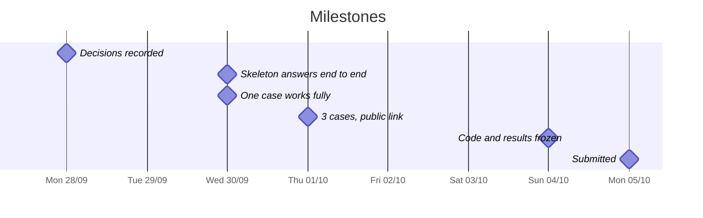

# Team plan

Sentinel Engine · Factored AI & Data Hackathon 2026 · Submission: **Monday 10/5, 11:59 pm (UTC-5)**

> We start on Monday 9/28. Day tasks live in [tasks](tasks.md) and open choices in [pending decisions](pending-decisions.md).

## Schedule

Tentative: we adjust it if anything slips.

| Day | Date | Goal | Milestone |
|---|---|---|---|
| Sun | 9/27 | Prepare: data access, repository, readings | Everyone has access |
| Mon | 9/28 | **Decide** flow, stack, owners and working method. First look at the data | Decisions recorded |
| Tue | 9/29 | Skeleton: 4 mock tools, orchestrator, simple chat, minimal pipeline. Analysis backing the flow | **The skeleton answers end to end** · *not reached: moved to Wed 9/30* |
| Wed | 9/30 | Skeleton (moved from Tue). Normal case with real data, JSON handoff, learned component vs baseline | **The skeleton answers end to end; one case works fully** |
| Thu | 10/1 | Ambiguous and human cases, Portuguese, adversarial set, deployment. Video script and slide outline start. P1 if time allows | **3 cases in es-419 and pt-BR, public link** · *partly reached: 3 cases in es-419; Portuguese serving and the public link still open* |
| Fri | 10/2 | Held-out evaluation and metrics. README in English, limitations; review the repo for secrets. Group validates the slide outline. Router v2 served with baseline fallback; router v3 planned ([plan](router-v3-plan.md)) | **Router v2 served** |
| Sat to Sun | 10/3 to 10/4 | Router v3, new held-out set and eval-v8; README and results. Freeze code at night on Sunday | **Code and results frozen** · *reached on Mon 10/5: router v3, the chat changes, the bank interface and the sealed v8 sets merged; the single v8 measurement ran once and the verdict serves `router_v2`* |
| Mon | 10/5 | Presentation review and video recording on the frozen build. Critical fixes only. Submit with margin, deadline 11:59 pm (UTC-5) | **Submitted** |

Per-person work is in [tasks](tasks.md), not on this chart. We want **code, results and README frozen by Sunday 10/4 night** (moved from Friday 10/2 on 10/2, to measure router v3). The presentation and the video are finished on Monday 10/5, on top of the frozen build. Set an internal submission time on Monday, well before 11:59 pm. Working first: if anything optional blocks a mandatory item, it waits. Priorities live in the [requirements](../docs/requirements/requirements.md).

## Decisions made

| Decision | Status | Record |
|---|---|---|
| Team name: Sentinel Engine | Accepted | — |
| Platform: Microsoft Azure | Accepted | [001](../docs/build/decisions/001-azure-platform.md) |
| Specs with OpenSpec, written in English (decision 18) | Accepted | [002](../docs/build/decisions/002-openspec.md) |
| Owners: Natalia, data and data analysis · Rubén, AI, architecture and ML · Felix, full-stack | Accepted | — |
| Hybrid LLM with a router across models: open-weight models on Fireworks AI, chosen per route by measurement (closes decision 10) | Accepted | [016](../docs/build/decisions/016-router-models.md) |
| Infrastructure budget: Natalia's estimate (USD 20-58, within the USD 200 Azure trial credit) as the working assumption | Accepted | [cost](../docs/build/cost.md) |
| Case store (disputes and handoff tickets), sessions and conversation state: SQLite for the submission (updated 10/1, mentor feedback: externalize conversation state), Postgres on Azure as the production backend of the same models; in memory only for tests and the offline eval. Not written to Gold | Accepted | [demo](../docs/architecture/demo-architecture.md), [path to production](../docs/architecture/specification.md#path-to-production) |
| No .NET: outside the team's stack (Python, FastAPI). Target is Azure; locally it runs on Linux | Accepted | [stack](../docs/architecture/system-architecture.md#stack-and-deployment) |
| Flow: transaction disputes, entered through an account inquiry (confirmed 9/29) | Accepted | [003](../docs/build/decisions/003-disputes-flow.md) |
| Repository language: everything in English, including `docs/` and `team/` (decision 19, closed 9/28) | Accepted | [pending decisions](pending-decisions.md) |
| No daily sync meeting. Slack if we talk every day; a status, if needed, at the end of the day (decision 5) | Accepted | [pending decisions](pending-decisions.md) |
| Backend: Python + FastAPI (decision 9); loop tool (LangGraph or plain Python) deferred | Accepted | [005](../docs/build/decisions/005-backend.md) |
| Frontend: one-page chat served by FastAPI; no Streamlit or Gradio (decision 11) | Accepted | [006](../docs/build/decisions/006-frontend.md) |
| Learned component: prompted LLM classifying the dispute category, against a keyword baseline, on team-written text | Accepted | [007](../docs/build/decisions/007-learned-component.md) |
| Prompted router behind `ModelPort` with route table, fixtures and safe fallback (change archived 9/30) | Accepted | `openspec/specs/llm-router/spec.md` |
| Evaluation evidence frozen: label universe, mix and thresholds in `evidence/evaluation/2024Q4-v1/` (change archived 9/30) | Accepted | `openspec/specs/evaluation-evidence/spec.md` |
| Evaluation runner frozen: bench + system replay in `evidence/evaluation-runs/2024Q4-eval-v1/` (change archived 9/30) | Accepted | `openspec/specs/evaluation-runner/spec.md` |
| Video and slides: Rubén. Script from Thursday 10/1. Slide outline Thursday 10/1, validated by the group Friday 10/2, reviewed from Friday to Monday with the results; frozen Monday 10/5 (decision 20) | Accepted | [delivery](../docs/build/delivery.md) |
| Tasks live in the repo; follow-up is in the team channel. Rubén reviews what is still pending (decision 6) | Accepted | [tasks](tasks.md) |
| Code: branch, push, Slack authorization, author merges. No direct push to `main` (decision 7) | Accepted | [pending decisions](pending-decisions.md) |
| No standing milestone meetings. Ad hoc only (decision 8) | Accepted | [pending decisions](pending-decisions.md) |
| One public repository (decision 21), organised by folders; no git submodules (decision 22). Service folder: `sentinel-ai-core/` | Accepted | [Folders](#folders) |
| Public link on Azure Container Apps, one Docker container; supersedes 012 after Hugging Face dropped its free Docker tier (closes decisions 13 and 16) | Accepted | [019](../docs/build/decisions/019-azure-container-apps.md) |
| Documentation layout: the `docs/understand/` folder is split into `docs/overview.md`, `docs/data/` and `docs/glossary/` (decision 30 in [pending decisions](pending-decisions.md)) | Accepted | [`docs-followups`](../openspec/changes/docs-followups/tasks.md) |
| Judge access: one shared set of test credentials, sent in the submission email; no passwordless entry on the public link | Accepted | [`judge-access`](../openspec/changes/judge-access/tasks.md) |
| Keep `team/` in the submission, reviewed before submitting (closes decision 23) | Accepted | [pending decisions](pending-decisions.md) |
| Demo UI with role landing and a read-only advisor view in the ai-core page; old mock backend and its reference page removed; no admin panel (closes decision 29) | Accepted | [009](../docs/build/decisions/009-demo-ui-and-advisor-view.md) |

Product and technical decisions go in [decisions](../docs/build/decisions/), one file per decision. Team decisions (working method, owners) are recorded here.

## Working method

| Topic | How we work |
|---|---|
| Communication | Everything in the team channel. Challenge questions go to the hackathon help channel |
| Status | No standing sync and no standing milestone meetings. We talk on Slack during the day. A meeting, individual or with the group, happens only when a task needs it; the outcome goes in the channel |
| Tasks | In [tasks](tasks.md), with owner, date and status |
| Specs | With OpenSpec: we propose each change before implementing and cite its requirements |
| Code | Branch per change, push, ask in Slack for authorization to merge. Any other teammate can authorize; the author merges. No direct push to `main` |
| Decisions | Product and technical ones in [decisions](../docs/build/decisions/); team ones here. We announce all of them in the channel |
| Progress | When a task closes, we update the requirement's card in its type file and its row in the [requirements index](../docs/requirements/requirements.md); open tasks are ordered by priority in [tasks](tasks.md#open-work-by-priority) |
| Repository | Single repo (`factored-hackathon-2026-sentinel-engine`), public from the start and it stays public |

Two hackathon rules are non-negotiable: no secrets or data in the repo (credentials go in `.env` and are shared by direct message), and the submission is in English.

## Folders

Two code folders. `sentinel-ai-core/` is the whole FastAPI process, including the chat, its policy configuration and the evaluation runner. It is not a separate AI service. No web package and no infrastructure folder.

That process serves one app from `sentinel-ai-core/app/main.py` (`app = create_app()`), with one API under `/api/v1`: `auth/{login,logout,me}`, `transactions`, `chat`, `disputes`, `handoffs` (advisor), `health`. The demo and the later service share it; only the adapters behind the ports change (Gold: DuckDB view or mock; state: SQLite or memory; model: baseline or prompted router). Disputes also have their own two-step API (`/api/v1/disputes/preview`, `/api/v1/disputes`, plus a read-only listing) running the chat's turn cycle.

| Path | Who | What | Status |
|---|---|---|---|
| `sentinel-data-engine/` | Natalia | Medallion pipeline. Gold table and columns of the [data contract](../docs/architecture/specification.md#data-contract), as-of date, labelled incremental fixture. | Done: run end to end on the full dataset into `data/gold_bank.duckdb`, reproduced by a fresh run on 10/02; incremental fixture tested (REQ-0018); Silver keeps the durations, `process_date` and `amount_usd` (PR #44); [source inventory](../docs/data_inventory.md) and [sizing](../docs/sizing-capacity.md) written; the [quality report](../sentinel-data-engine/data_quality_report.md) is generated by the runner, and a `verify` mode checks its figures (`quality-report`, PR #54) |
| `sentinel-ai-core/app/static/`, `routers/` | Felix | Chat page with the confirm box, `POST /api/v1/chat` with the structured confirmation field ([confirmation](../docs/architecture/specification.md#confirmation)). | Done: chat page, test session, `POST /api/v1/chat` and confirm box verified end to end; role landing and read-only advisor view of `GET /api/v1/handoffs` ([009](../docs/build/decisions/009-demo-ui-and-advisor-view.md)) |
| `sentinel-ai-core/app/session/` | Felix | Test session and [conversation state](../docs/architecture/specification.md#conversation-state), deleted on expiry. | Done: password login on `/api/v1/auth/*` with roles (customer, demo advisor behind `SENTINEL_DEMO_AUTH`); sessions and conversation in SQLite keyed by a token hash, deleted on logout and expiry |
| `sentinel-ai-core/app/orchestrator/`, `policy/`, `ai/` | Rubén | Loop, policy engine (evaluates the rules and the decision priority), `confirmation_token`, router, learned component. | Done: loop and policy engine with tests; router_v2 served behind `ModelPort` with a baseline fallback, measured against the baseline in `2024Q4-eval-v8` (decision 016); the v8 verdict serves router_v2; the "why?" answer from the stored decision (PR #42); narrowing, the prompt-extraction refusal, the injection record and the Gold read budget (PR #49); contract v3, openers, status answers and validated drafts (`router-v3` and `chat-start`, PRs #59 and #62). Prompt v3, the cut-offs and the charge selector are off by default |
| `sentinel-ai-core/config/policy/` | Rubén | Policy parameters, not code: synthetic [policy source](../docs/architecture/specification.md#policy-source), one file per country (MX, CO, AR), fraud and high-amount thresholds per currency ([010](../docs/build/decisions/010-fraud-handoff-rule.md), [011](../docs/build/decisions/011-high-amount-threshold.md)), staleness (decision 27). Read by the engine in `app/policy/`. | Done: synthetic p95 values per account country and currency from `evidence/evaluation/2024Q4-v2/summary.json`; Mexican MXN has none; staleness stays off |
| `sentinel-ai-core/app/tools/` | Felix and Rubén | The four tool contracts. Natalia owns what Gold returns. | Done: `lookup_transactions` with isolation, currency and canary tests; open and read-back on the SQLite case store with one open dispute per charge; handoff filed as a ticket; Gold reads under a time budget, from the mock or the DuckDB file (PR #50) |
| `sentinel-ai-core/app/privacy/` | Felix | Masks personal identifiers typed by the customer before the orchestrator, the model, the logs and stored state (REQ-0047, decision 004). | Done: `tests/privacy/`; adversarial A9 blocked |
| `sentinel-ai-core/app/observability/` | Rubén | Structured log records with `trace_id`, latency, tokens and cost ([observability](../docs/architecture/specification.md#observability)). | Done: records + JSONL writer wired from `step()` and `POST /api/v1/chat`, `var/` anchored to the package; acceptance replay test green |
| `sentinel-ai-core/eval/` | Rubén | [Evaluation](../docs/architecture/specification.md#evaluation) cases (JSONL) and runner, system vs baseline, with fault injection. | Done: development cases, the sealed held-out sets measured once (`2024Q4-eval-v8`) and the multi-turn resolution set (`2024Q4-resolution-v1`, PR #48); runner with the confirmation turn, fault injection and offline `verify` |
| `evidence/` (evaluation runs) | Natalia | Metrics by language and country from the runner's output, frozen per run; cost per resolution (REQ-0055, REQ-0057). | Done: label universe `evidence/evaluation/2024Q4-v1/` and thresholds `2024Q4-v2`, both verified on the regenerated data on 10/02; runs frozen per folder, latest `2024Q4-eval-v7` and `2024Q4-resolution-v1`; breakdown by language and country of system outcomes and cost per resolution against the baseline as ROI are `evaluation-final` |
| `sentinel-ai-core/app/services/`, `tools/gold_duckdb.py`, `schemas/`, `db/`, `models/` | Natalia, Felix | PII-free Gold view reader behind `GoldTransactions` (fallback to the mock), the typed API contract (`schemas/chat.py`), and the SQLite models and stores for sessions, conversation and cases (`db/`, `models/`, `state/`). | Done: contract, SQLite state and the Gold reader over the pipeline's DuckDB file with tests (PRs #43 and #50); a local users file for real customers is written outside git |
| Infrastructure as code | Nobody yet | Not needed for the submission: it runs on Azure Container Apps from `deploy/azure/deploy.sh` ([019](../docs/build/decisions/019-azure-container-apps.md)); scaled-out Azure infrastructure stays production work. | Not started |

Evaluation lives inside `sentinel-ai-core/` because it drives `POST /api/v1/chat`; it is not a third code folder. Its results follow the write-once rule of `evidence/`.

## Mocks

We start with well-documented mocks and swap them for the real thing one by one, without touching their contracts. Shown here for the transaction-disputes flow.

- **Wed 9/30, skeleton (planned for Tue 9/29):** the loop and the policy engine are in `sentinel-ai-core/`, with in-memory fakes for look up, open (idempotent) and read-back. Chat, the test session and `POST /chat` are connected and verified end to end; the confirm box, structured logs, adversarial set (29 attacks, `0/29` unsafe), prompted router, evaluation evidence and evaluation runner all landed and were archived 9/30. The handoff stays an outcome, not a tool. Policy lives in code; country parameters live in `config/policy/`. The LLM understands, drafts and picks which tool to call, but never decides permissions or confirms actions.
- **When we swap each mock:** when the milestone asks for it, without changing the contract.

| Milestone | Stays a mock | Becomes real | Not in this submission |
|---|---|---|---|
| Tue 9/29 | Nothing was ready; the skeleton moves to Wed | — | — |
| Wed 9/30 | Four tools in memory, test session, synthetic policy configuration, simulated advisor, `.env` | Chat and `POST /chat`, orchestrator loop, policy engine, JSON handoff | Identity provider, Key Vault |
| Thu 10/1 | Test session with false credentials, synthetic policy, demo advisor user, Gold mock when the DuckDB view is absent | Case store, sessions and conversation out of the process (SQLite); DuckDB Gold adapter; advisor ticket view; structured confirmation, bounded retries, structured logs | PostgreSQL and more than one instance |
| Fri 10/2 | Anything not reached, reported as a limitation | Evaluation runner and results. Incremental pipeline (tested), free-text masking before the model | Advisor delivery channel: queue to the CRM ([015](../docs/build/decisions/015-handoff-delivery.md)) |

The dispute-record engine is SQLite for the submission; Postgres is the production step (URL change, same models).
- **Rule:** every mock documents its contract and limitations, as the brief asks (Data and execution boundaries): REQ-0004 (safe tools), REQ-0007 (permissions in code), REQ-0032 (documented mocks).
- **Learned component:** where today a fixed rule stands, we keep it as the baseline and compare it with the component on the same held-out set (REQ-0016).
